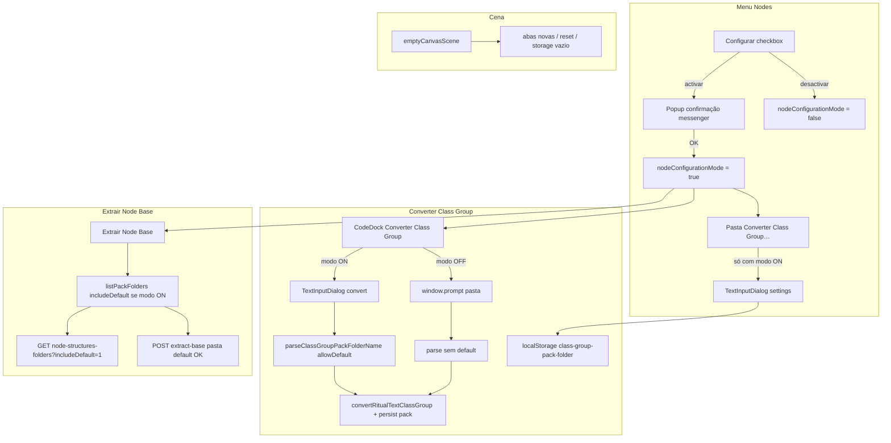
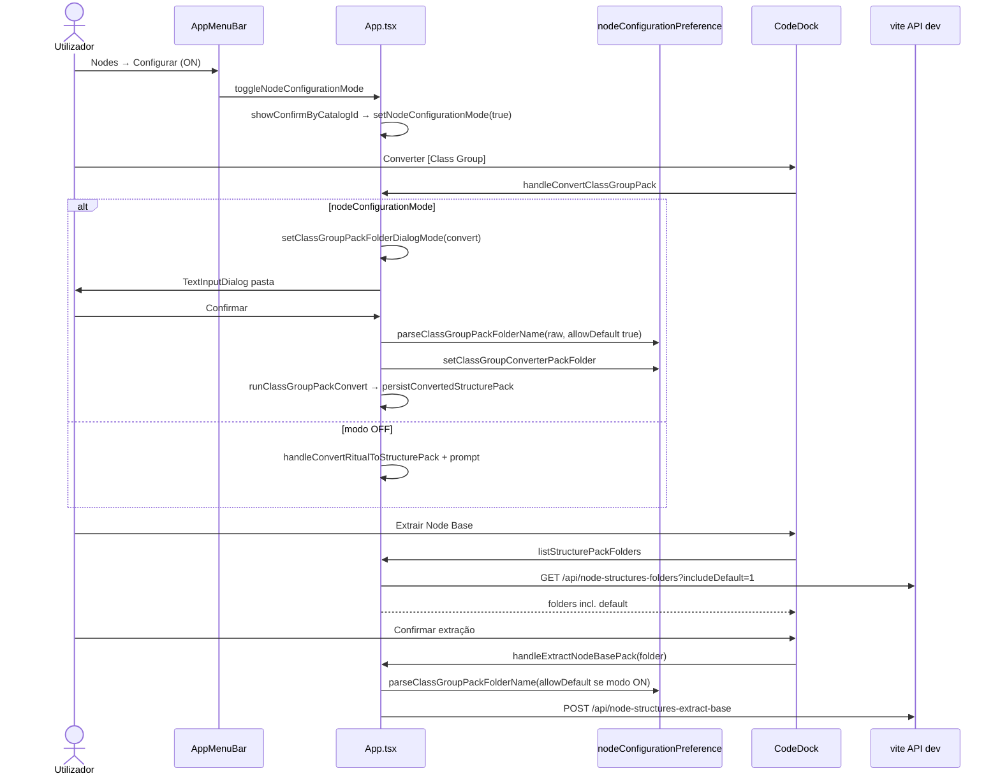

# Documentação de Implementação — Nodes Configurar, pasta Class Group e pack `default`

Arquivo salvo em: `feature_md/feature/feature-nodes-configurar-pack-default.md`

## 1. Cabeçalho

| Campo | Valor |
| --- | --- |
| Nome da Branch | `feature/nodes-configurar-pack-default` |
| Nome das Features | Modo Nodes → Configurar; pasta predefinida Converter [Class Group]; pack `default` em dev; cena inicial vazia; Extrair Node Base com Configurar |
| Versão atual | `1.5.0` |
| Hash do Commit | `03aaec0` |

## 2. Definição e Resumo de Tags

| Tag | Definição |
| --- | --- |
| `[NOVO]` | Módulo, diálogo ou endpoint criado nesta branch. |
| `[ATUALIZADO]` | Fluxo ou componente existente alterado. |
| `[REMOVIDO]` | Comportamento ou ficheiros deixados de ser obrigatórios. |

Tags presentes nesta implementação:

- `[NOVO]`
- `[ATUALIZADO]`
- `[REMOVIDO]`

## 3. Fluxograma de Funcionamento

## 4. Fluxograma de Acionamento de Funções

## 5. Tabela de Funções e Componentes

| Status | Nome | Feature Correspondente | Descrição Técnica | Parâmetros / Retorno |
| --- | --- | --- | --- | --- |
| `[NOVO]` | `nodeConfigurationPreference.ts` | Pasta Class Group | Lê/grava `class-group-pack-folder` no `localStorage`; `parseClassGroupPackFolderName` com `allowDefault`. | `get/setClassGroupConverterPackFolder()` → `string` / `string \| null` |
| `[NOVO]` | `demoCanvasScene.ts` | Testes | Cena de exemplo com schemas embutidos (sem pack `default` no bundle). | `demoCanvasScene: CanvasScene` |
| `[NOVO]` | `TextInputDialog` (pasta Class Group) | Configurar + Converter | Dois modos: `settings` (predefinição) e `convert` (antes de converter). | `onConfirm(raw: string)` |
| `[ATUALIZADO]` | `toggleNodeConfigurationMode` | Configurar | Activar modo **não** abre diálogo de pasta (só confirmação messenger). | — |
| `[ATUALIZADO]` | `handleConvertClassGroupPack` | Converter Class Group | Com Configurar ON → diálogo; permite pasta `default`. | — |
| `[ATUALIZADO]` | `listPackFolders` / `listStructurePackFolders` | Extrair / nomenclatura | Inclui `default` quando `nodeConfigurationMode`. | `Promise<string[]>` |
| `[ATUALIZADO]` | `handleExtractNodeBasePack` | Extrair Node Base | Aceita `default` com Configurar ON. | `folder: string` → `boolean` |
| `[ATUALIZADO]` | `vite.plugin.nodeStructuresWrite` | API dev | `?includeDefault=1` na listagem; `write` e `extract-base` permitem `default`; `delete` mantém bloqueio. | HTTP |
| `[ATUALIZADO]` | `AppMenuBar` | Configurar | Item «Pasta Converter Class Group…» visível só com modo ON. | `onEditClassGroupPackFolder?` |
| `[ATUALIZADO]` | `emptyCanvasScene` | Cena vazia | Cena inicial, reset e fallbacks sem nós demo. | `CanvasScene` |
| `[ATUALIZADO]` | `loadStoredScene` | Storage legacy | Cena vazia guardada permanece vazia (não repõe demo). | `CanvasScene` |
| `[REMOVIDO]` | `staticCanvasScene` (demo obrigatória) | Cena inicial | Substituída por `emptyCanvasScene`; alias legado aponta para vazia. | — |
| `[REMOVIDO]` | `ROOT_NODE_ID` / `particle-root-01` | Selecção / reset | Sem nó raiz fixo na selecção ou reset. | — |
| `[REMOVIDO]` | Pack `src/nodeStructures/default/` | Demo estática | Removido do bundle; `default` só via conversão em Configurar. | — |
| `[REMOVIDO]` | `schemaRef` em `canvasScene.ts` | Arranque | Eliminado erro ao falhar `particle-root` no registo. | — |

## 6. Descrição Detalhada de Funcionamento

### Modo Configurar

O menu **Nodes → Configurar** activa `nodeConfigurationMode` após confirmação no catálogo messenger (`MESSENGER_CONFIRM_NODE_CONFIGURATION_MODE`). Ao activar, **não** se abre qualquer diálogo de pasta — apenas o modo de edição avançada no inspector (parâmetros obrigatórios, links, hash string, etc.).

Com o modo activo, o utilizador pode:

1. **Converter [Class Group]** — abre `TextInputDialog` com a pasta predefinida (`getClassGroupConverterPackFolder`, por defeito `importado`). Pode indicar **`default`**; o nome é sanitizado e gravado em `localStorage` antes da conversão.
2. **Pasta Converter Class Group…** (menu Nodes) — edita só a predefinida para conversões futuras.
3. **Extrair Node Base** — a lista de packs inclui `default` (API `includeDefault=1` + entrada explícita na lista). A extração e gravação em disco funcionam para essa pasta em `npm run dev`.

Sem Configurar, **Converter [Class Group]** e **Converter [Jade fx_editor]** continuam a usar `window.prompt`; a pasta `default` continua **bloqueada** nesse fluxo. **Deletar pack** nunca lista nem apaga `default`.

### Cena sem nó raiz obrigatório

`emptyCanvasScene` (1120×760, zero nós) é a cena por defeito para abas novas, `resetScene`, storage vazio ou inválido. Removida a dependência de `schemaRef('particle-root')` no arranque do módulo — evita crash quando o pack `default` não existe no disco.

Testes que precisavam da cena demo usam `demoCanvasScene` com schemas embutidos no ficheiro de teste.

### API de desenvolvimento

Em `vite.plugin.nodeStructuresWrite.ts`:

- **GET** `/api/node-structures-folders?includeDefault=1` — devolve também a pasta `default` se existir em `src/nodeStructures/`.
- **POST** `/api/node-structures-write` — permite criar/atualizar pack `default`.
- **POST** `/api/node-structures-extract-base` — permite extrair parâmetros base de `default`.
- **POST** `/api/node-structures-delete` — continua a rejeitar `default`.

### Tratamento de erros

- Nome de pasta inválido após sanitização → alerta genérico (sem mencionar `default` reservada quando `allowDefault` está activo).
- Conversão ritual falha → `window.alert` com mensagem do conversor.
- Extração sem `npm run dev` → alerta a indicar que só funciona com servidor de desenvolvimento.
- Pasta de pack inexistente no disco na extração → HTTP 400 «Pasta do pack não existe».

### Tecnologias

React 19, TypeScript, Vite middleware para `nodeStructures`, `localStorage` para preferência de pasta, `TextInputDialog` reutilizável, Vitest para `nodeConfigurationPreference`.
