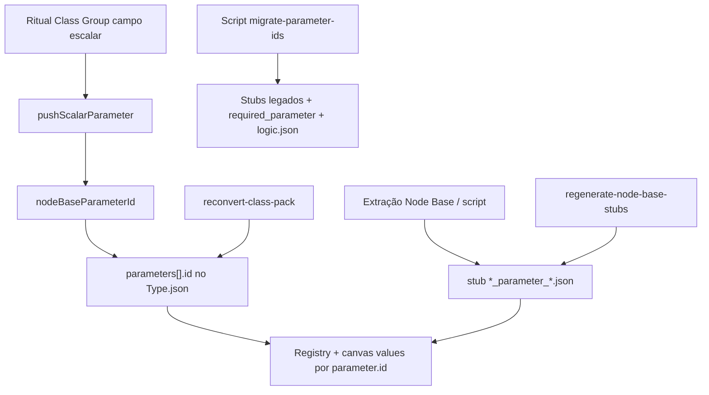
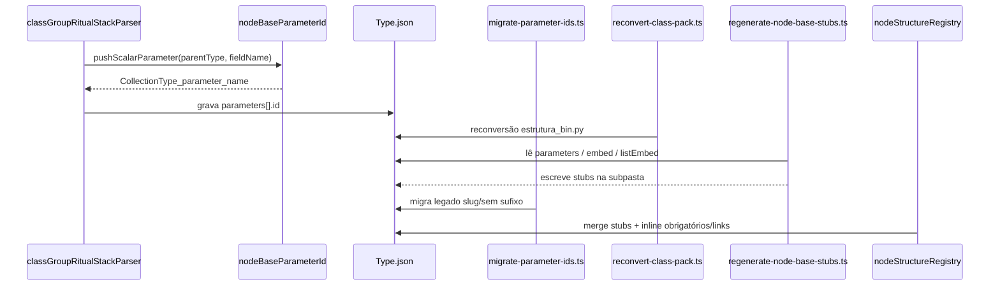

# Documentação de Implementação — Sufixo `_parameter_` nos parâmetros

Arquivo salvo em: `feature_md/feature/feature-parameter-suffix-class-group.md`

## 1. Cabeçalho

| Campo | Valor |
| --- | --- |
| Nome da Branch | `feature/parameter-suffix-class-group` |
| Nome das Features | IDs canónicos `{collectionType}_parameter_{paramName}`; parser Class Group; migração de stubs/schemas/workspace; reconversão de packs |
| Versão atual | `1.4.0` |
| Hash do Commit | `a73d000` (base antes desta feature; actualizar após commit) |

Base sugerida: `feature/embed-class-group`.

## 2. Definição e Resumo de Tags

| Tag | Definição |
| --- | --- |
| `[NOVO]` | Novo script, helper ou função criada nesta branch. |
| `[ATUALIZADO]` | Componente ou fluxo existente alterado para o novo padrão de ID. |

**Tags presentes nesta implementação:** `[NOVO]`, `[ATUALIZADO]`

## 3. Padrão de IDs (alinhamento com EMBED / LIST_EMBED)

| Tipo | Padrão | Exemplo |
| --- | --- | --- |
| Parâmetro | `{collectionType}_parameter_{paramName}` | `VfxEmitterDefinitionData_parameter_AlphaRef` |
| EMBED | `{collectionType}_embed_{title}` | `VfxEmitterDefinitionData_embed_rate` |
| LIST_EMBED | `{collectionType}_listEmbed_{title}` | `SkinCharacterDataProperties_listEmbed_IdleParticlesEffects` |

Antes: parâmetros usavam `{collectionType}_{paramName}` nos stubs e **slug** no corpo do schema (`vfx-emitter-definition-data-alpha-ref`), gerando dois IDs para o mesmo campo.

## 4. Fluxograma de Funcionamento



## 5. Fluxograma de Acionamento de Funções



## 6. Tabela de Funções e Componentes

| Status | Nome | Feature | Descrição técnica | Parâmetros / retorno |
| --- | --- | --- | --- | --- |
| `[ATUALIZADO]` | `nodeBaseParameterId` | Sufixo `_parameter_` | Fonte única do ID canónico de parâmetro | `(collectionType, paramName) → string` |
| `[NOVO]` | `isLegacyParameterId` | Sufixo `_parameter_` | Detecta id legado sem marcador estrutural | `(id) → boolean` |
| `[NOVO]` | `migrateParameterId` | Sufixo `_parameter_` | Converte `{ct}_{name}` ou usa `paramName` explícito | `(collectionType, legacyId, paramName?) → string` |
| `[NOVO]` | `migrateParameterIdLoose` | Sufixo `_parameter_` | Migração inferindo `collectionType` do prefixo (workspace) | `(legacyId) → string` |
| `[ATUALIZADO]` | `pushScalarParameter` | Parser Class Group | Deixa de usar `slugifyStructureId` para parâmetros inline | — |
| `[NOVO]` | `isParameterStubShape` | Registry | Distingue stub de parâmetro de embed malformado | `(raw) → boolean` |
| `[NOVO]` | `scripts/migrate-parameter-ids.ts` | Migração | Stubs, corpos, `parameters_list`, `logic.json` | CLI |
| `[NOVO]` | `scripts/regenerate-node-base-stubs.ts` | Pós-reconversão | Recria stubs e `temp/parameters_list.json` | `[pack]` opcional |
| `[ATUALIZADO]` | `nodeParameterDefinitionFromJsonStub` | Registry | Usa `isParameterStubShape` antes de parse | `(raw) → NodeParameterDefinition \| null` |

## 7. Descrição Detalhada de Funcionamento

A feature unifica a nomenclatura de parâmetros com a já adoptada para blocos **EMBED** e **LIST_EMBED**. O conversor Class Group passa a atribuir `parameters[].id` via `nodeBaseParameterId(parentType, fieldName)`, onde `parentType` é o nome do tipo ritual (ex.: `VfxEmitterDefinitionData`).

Os ficheiros «node base» na subpasta `pack_CollectionType` usam stem `vfxemitterdefinitiondata_parameter_alpharef.json` e campo `"id": "VfxEmitterDefinitionData_parameter_AlphaRef"`, alinhados ao inline do corpo `VfxEmitterDefinitionData.json`.

**Migração:** `migrate-parameter-ids.ts` percorre `src/nodeStructures`, renomeia stubs legados, actualiza `required_parameter`, `linked_parameter_values`, `hashStringParameterId` nos corpos e tenta alinhar `src/data/workspace/logic.json`. É idempotente para ids que já contêm `_parameter_`.

**Reconversão:** `npx vite-node scripts/reconvert-class-pack.ts quebec` (e `papa`) regenera os corpos a partir de `estrutura_bin.py` e remove JSON órfãos (incluindo stubs antigos). Em seguida, `npx vite-node scripts/regenerate-node-base-stubs.ts quebec` recria stubs e a lista em `temp/parameters_list.json`.

**Runtime:** módulos como `fx_required_parameter`, `linked_parameter_values`, `hashString`, `useSceneHistory` e o catálogo `+ Element` continuam a indexar por `parameter.id`; após migração, todos os ids seguem o mesmo prefixo.

**Validação alvo (`quebec_VfxEmitterDefinitionData`):**

- Stubs: `vfxemitterdefinitiondata_parameter_*.json`
- Corpo: `parameters[].id` com `VfxEmitterDefinitionData_parameter_*` (sem slug)
- Testes Vitest: **200** testes

## 8. Comandos

```bash
npx vite-node scripts/migrate-parameter-ids.ts
npx vite-node scripts/reconvert-class-pack.ts quebec
npx vite-node scripts/reconvert-class-pack.ts papa
npx vite-node scripts/regenerate-node-base-stubs.ts quebec
npm test
```

## 9. Riscos e mitigação

| Risco | Mitigação |
| --- | --- |
| Centenas de JSON em packs grandes | Scripts idempotentes + reconversão + regeneração de stubs |
| Duplicados slug + legacy no mesmo schema | Reconversão substitui inline; migrate + regenerate stubs |
| Workspaces antigos | `migrate-parameter-ids` actualiza `logic.json`; reabrir projeto após pull |
