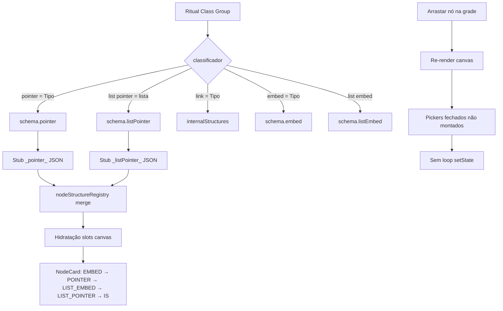
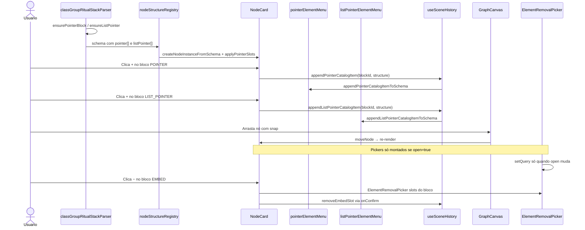

# Documentação de Implementação — POINTER / LIST_POINTER (Class Group, UI e correção ElementRemovalPicker)

Arquivo salvo em: `feature_md/feature/feature-pointer-class-group.md`

## 1. Cabeçalho

| Campo | Valor |
| --- | --- |
| Nome da Branch | `feature/pointer-class-group` |
| Nome das Features | POINTER e LIST_POINTER no schema e conversor Class Group; secções no card; slots, stubs, menus Element; correção de loop infinito no `ElementRemovalPicker` ao arrastar nós na grade |
| Versão atual | `1.4.0` |
| Hash do Commit | `COMMIT_HASH_PLACEHOLDER` |

Base: `feature/list-embed-class-group`.

## 2. Definição e Resumo de Tags

| Tag | Definição |
| --- | --- |
| `[NOVO]` | Novo componente, arquivo, função ou tipo criado nesta branch. |
| `[ATUALIZADO]` | Componente ou fluxo existente alterado para suportar a feature ou corrigir regressão. |
| `[REMOVIDO]` | Código ou comportamento removido ou descontinuado. |

Tags presentes nesta implementação:

- `[NOVO]`
- `[ATUALIZADO]`

## 3. Fluxograma de Funcionamento

## 4. Fluxograma de Acionamento de Funções

## 5. Tabela de Funções e Componentes

| Status | Nome | Feature | Descrição Técnica | Parâmetros / Retorno |
| --- | --- | --- | --- | --- |
| [NOVO] | `PointerDefinition` / `ListPointerDefinition` | Schema | Tipos espelho de `EmbedDefinition` / `ListEmbedDefinition`; `pointer?[]`, `listPointer?[]` em `NodeSchemaDefinition`. | `nodeSchema.ts` |
| [NOVO] | `nodeBasePointerId` / `nodeBaseListPointerId` | Node base | IDs canónicos `{collectionType}_pointer_{title}` e `_listPointer_`. | `extractNodeBaseParameters.ts` |
| [NOVO] | `buildNodeBasePointerPayload` / `readPointerBlocksFromSchemaJson` | Node base | Stubs e leitura do corpo JSON. | payloads para disco |
| [NOVO] | `parsePointer` / `isPointerStubShape` | JSON | Parse de arrays e stubs; não confundir com listPointer. | `nodeStructureJson.ts` |
| [NOVO] | `mergePointerStubsIntoSchema` | Registry | Merge por `title`; ordem parameter → embed → pointer → listEmbed → listPointer. | `nodeStructureRegistry.ts` |
| [NOVO] | `applyPointerSlotsToSchema` | Canvas | Hidrata slots na instância. | `canvasScene.ts` |
| [NOVO] | `INLINE_POINTER_OPEN_REGEX` / `INLINE_LINK_OPEN_REGEX` | Classificador | Separa `pointer` de `link`; `isPointerListType`. | `classGroupFieldClassifier.ts` |
| [ATUALIZADO] | `classGroupRitualStackParser` | Class Group | `pointer =` → POINTER; `list[pointer]` → LIST_POINTER; `link =` → IS. | `ensurePointerBlock`, `ensureListPointer` |
| [NOVO] | `pointerSlots.ts` / `listPointerSlots.ts` | Runtime | Slots `__slot__`, populate, linking, `findSlotInPointerSchema`. | espelho embed/listEmbed |
| [NOVO] | `pointerElementMenu.ts` / `listPointerElementMenu.ts` | Menus | Append/remove catálogo, blocos e slots. | `appendPointerCatalogItemToSchema` |
| [NOVO] | `PointerItem.tsx` / `ListPointerItem.tsx` | UI card | Secções POINTER e LIST_POINTER com +/- e portas. | props como EmbedItem |
| [ATUALIZADO] | `NodeCard.tsx` | UI card | Ordem: Parameters → EMBED → POINTER → LIST_EMBED → LIST_POINTER → IS; pickers condicionais. | `EMPTY_REMOVAL_ELEMENTS` |
| [ATUALIZADO] | `GraphCanvas.tsx` | Canvas | Alturas/portas Y para pointer e listPointer; wires e catálogo IS filtrado. | `getPointerPortY`, `getListPointerPortY` |
| [ATUALIZADO] | `useSceneHistory.ts` | Histórico | `appendPointerCatalogItem`, `removePointerBlock`, etc. | mutações undo/redo |
| [ATUALIZADO] | `elementMenuCatalogUtils.ts` | Element + | `catalog-pointer`, `catalog-list-pointer`, ações append. | `append-pointer-catalog` |
| [ATUALIZADO] | `elementMenuScopeCatalog.ts` | Catálogo | `filterOutPointerCatalogChildStructures` e listPointer. | menu IS |
| [ATUALIZADO] | `listNodeElements.ts` | Element − | Kinds `pointerBlock`, `pointerSlot`, `listPointerBlock`, `listPointerSlot`. | removíveis |
| [ATUALIZADO] | `collectionTypeLinking.ts` | Ligações | Resolve slots pointer/listPointer nas ligações entre nós. | `findPointerBySlotId` |
| [ATUALIZADO] | `vite.plugin.nodeStructuresWrite.ts` | API dev | Grava stubs `*_pointer_*` e `*_listpointer_*`. | CodeDock |
| [ATUALIZADO] | `regenerate-node-base-stubs.ts` | Scripts | Regenera stubs pointer/listPointer por pack. | `npx vite-node scripts/...` |
| [ATUALIZADO] | `ElementRemovalPicker.tsx` | Correção UI | `setQuery` só quando `open` muda; validação de `selectedKey` só com picker aberto. | evita loop no drag |
| [ATUALIZADO] | `ElementRemovalPicker` integração `NodeCard` | Correção UI | Removidos 4 `useEffect` que limpavam `removalSelectedKey` em cascata; montagem condicional `{open ? <Picker /> : null}`. | fix Maximum update depth |
| [ATUALIZADO] | `listEmbedSlots.findOutputSlotInNode` | Ligações | Inclui slots de `pointer[]` na resolução de porta de saída. | compatibilidade wires |
| [NOVO] | `pointerSlots.test.ts` / `pointerElementMenu.test.ts` | Testes | Cobertura de slot único e append. | Vitest |
| [ATUALIZADO] | `nodeStructureJson.test.ts` | Testes | `isPointerStubShape`, `isListPointerStubShape`. | stubs |
| [ATUALIZADO] | `prompet_elements.md` | Docs | Secções POINTER / LIST_POINTER e kinds no menu. | referência elementos |
| [NOVO] | Pack `romel` reconvertido | Dados | Stubs pointer/listPointer gerados (ex.: 18 pointer, 3 listPointer). | `reconvert-class-pack.ts romel` |

## 6. Descrição Detalhada de Funcionamento

Esta branch introduz **POINTER** (singular) e **LIST_POINTER** (lista) no editor de grafos, espelhando **EMBED** e **LIST_EMBED**, e corrige um loop infinito de React ao arrastar nós na grade.

### Regras de classificação no ritual

| Sintaxe no ritual | Destino no schema |
| --- | --- |
| `pointer = Tipo { }` | `pointer[]` — bloco com **máximo 1** slot |
| `list[pointer] = { … }` | `listPointer[]` — bloco com **N** slots |
| `link = Tipo { }` | `internalStructures[]` (inalterado) |
| `embed =` / `list[embed]` | `embed[]` / `listEmbed[]` (inalterado) |

Ordem no card: **Parameters → EMBED → POINTER → LIST_EMBED → LIST_POINTER → Internal_Structures**.

### IDs canónicos e stubs

Para evitar triplicação entre corpo inline e stubs (lição do pack `romel` com EMBED):

- POINTER: `{collectionType}_pointer_{title}` → ficheiro `*_pointer_*.json`
- LIST_POINTER: `{collectionType}_listPointer_{title}` → ficheiro `*_listpointer_*.json`

O registry funde stubs por **`title`** na ordem: parameter → embed → pointer → listEmbed → listPointer.

### UI e menus

- **POINTER / LIST_POINTER** no card com `PointerItem` / `ListPointerItem` (botões +/- por bloco).
- Pickers de adição reutilizam `EmbedAddPicker` / `ListEmbedAddPicker` com mapeamento de choices.
- Menu **+ Element**: entradas `catalog-pointer` e `catalog-list-pointer` com acções `append-pointer-catalog` e `append-list-pointer-catalog`.
- **− Element**: novos kinds na remoção (`pointerBlock`, `pointerSlot`, `listPointerBlock`, `listPointerSlot`).

### Correção: loop ao mover na grade

**Problema:** `Maximum update depth exceeded` em `ElementRemovalPicker.tsx:93` (`setQuery('')`) durante arrasto de nós.

**Causas:**

1. Cinco instâncias de `ElementRemovalPicker` por `NodeCard`, todas com `useEffect` dependente de `elements` mesmo com `open={false}`.
2. Arrays vazios `[]` novos a cada re-render (`useMemo` com dependência em `node`).
3. Quatro `useEffect` no `NodeCard` que chamavam `setRemovalSelectedKey(null)` sempre que *outros* pickers estavam fechados.

**Correcção:**

- `ElementRemovalPicker`: limpar `query` só quando `open` passa a `false`; validar `selectedKey` apenas com picker aberto.
- `NodeCard`: remover `useEffect` globais; reset da chave em `onClose` / `onConfirm`; constante `EMPTY_REMOVAL_ELEMENTS`; montar pickers só quando `open === true`.

### Persistência e reconversão

- `vite.plugin.nodeStructuresWrite.ts` e `scripts/regenerate-node-base-stubs.ts` estendidos para pointer/listPointer.
- Pack piloto **romel** reconvertido: `npx vite-node scripts/reconvert-class-pack.ts romel` + regenerate stubs.

### Testes

213 testes Vitest, incluindo parser (`classGroupRitualStackParser.test.ts`), stubs (`nodeStructureJson.test.ts`), `pointerSlots.test.ts`, `pointerElementMenu.test.ts` e testes de classificador (`isPointerListType`).

### Tratamento de erros

- Parser ignora campos duplicados com aviso (comportamento existente do Class Group).
- Stubs com shape incorrecto não são classificados como POINTER (`isPointerStubShape` exclui `_listPointer_`).
- Remoção de slot/bloco limpa conexões do canvas via `useSceneHistory` (mesmo padrão EMBED/LIST_EMBED).
