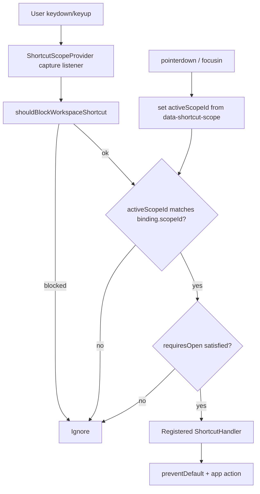
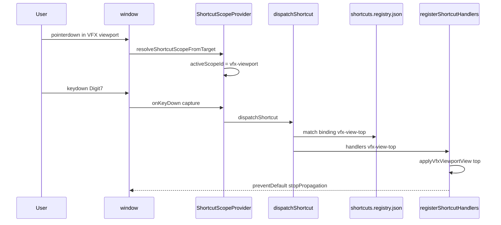

# Implementation Documentation — Shortcut scope system

**Save location:** `feature_md/feature/feature-shortcut-scope-system.md`

---

## 1. Header / Cabeçalho

| Field | Value |
| --- | --- |
| Branch name | `feature/shortcut-scope-system` |
| Feature name | Centralized keyboard shortcuts by UI scope (zone) |
| Version | `1.5.0` |
| Commit | `790e264` |

---

## EN — English sections

### 2. Tag definitions and summary

| Tag | Definition |
| --- | --- |
| `[NEW]` | New module, component, function, or binding created in this branch. |
| `[UPDATED]` | Existing flow changed to use the centralized shortcut system. |
| `[REMOVED]` | Local `window.addEventListener('keydown')` workspace listeners removed. |

Tags present in this implementation: `[NEW]`, `[UPDATED]`, `[REMOVED]`

### 3. Operation flowchart

### 4. Function activation sequence

### 5. Functions and components table

| Status | Name | Feature | Technical description | Parameters / return |
| --- | --- | --- | --- | --- |
| `[NEW]` | `shortcuts.registry.json` | Shortcut registry | Declarative bindings: `id`, `scopeId`, `key`, `modifiers`, `requiresOpen`, `priority`, `eventTypes` | JSON import |
| `[NEW]` | `shortcutScopes.ts` | Scopes | Constants: `graph-canvas`, `code-dock`, `vfx-viewport`, `node-palette`; dock ids | — |
| `[NEW]` | `shortcutTypes.ts` | Types | `ShortcutHandler`, `ShortcutsRegistry`, `ShortcutHandlerContext` | — |
| `[NEW]` | `normalizeKeyboardChord.ts` | Key normalization | `KeyboardEvent` → logical key + chord id; Digit7/Numpad7 → `7`; Meta as Ctrl alias on macOS | `NormalizedKeyboardChord` |
| `[NEW]` | `shortcutFocus.ts` | Focus | Reads `data-shortcut-scope` from DOM; fallback `graph-canvas` | `EventTarget` → `ShortcutScopeId` |
| `[NEW]` | `shortcutGuards.ts` | Guards | Blocks shortcuts in modals, pickers, form controls; `isCodeDockEditorFocused` | `KeyboardEvent` → `boolean` |
| `[NEW]` | `shortcutDispatcher.ts` | Dispatcher | Index registry by scope; match chord + guards; invoke handler | `dispatchShortcut` → `boolean` |
| `[NEW]` | `ShortcutScopeProvider.tsx` | Provider | Global capture listener; `activeScopeId`; `registerShortcutHandlers`; `setOpenDocks` | React context |
| `[NEW]` | `useAppShortcutHandlers.ts` | Graph undo/delete | Registers graph-undo, redo, delete bindings | App callbacks |
| `[NEW]` | `useGraphCanvasShortcutHandlers.ts` | Canvas shortcuts | Ctrl+K, A, G, ., Escape, Neeko paste | Refs + callbacks |
| `[NEW]` | `useVfxViewportShortcutHandlers.ts` | VFX views | 7/3/1/5 + Ctrl variants, projection toggle 5 | Three.js camera + controls |
| `[NEW]` | `useCodeDockShortcutHandlers.ts` | Code editor | Ctrl+F/H/Z/Y/O/P | Jade editor actions |
| `[NEW]` | `useAddNodePaletteShortcutHandlers.ts` | Palette | M expand / N compact with hover/Ctrl rules | Palette refs |
| `[NEW]` | `useRitualDragShortcutHandlers.ts` | Ritual drag | Ctrl/Meta spawn Neeko while dragging | `ritualDrag.phase === dragging` |
| `[UPDATED]` | `canvasKeyboardGuard.ts` | Legacy API | Re-exports from `shortcutGuards.ts` (no circular import) | — |
| `[UPDATED]` | `main.tsx` | Bootstrap | Wraps app with `ShortcutScopeProvider` | — |
| `[UPDATED]` | `App.tsx` | App | Uses `useAppShortcutHandlers`; syncs dock open state | — |
| `[UPDATED]` | `GraphCanvas.tsx` | Canvas | `data-shortcut-scope="graph-canvas"`; removed local keydown listeners | — |
| `[UPDATED]` | `CodeDock.tsx` | Code dock | `data-shortcut-scope="code-dock"` | — |
| `[UPDATED]` | `VfxViewport.tsx` | VFX | `data-shortcut-scope="vfx-viewport"` | — |
| `[UPDATED]` | `AddNodePalette.tsx` | Palette | `data-shortcut-scope="node-palette"` | — |
| `[UPDATED]` | `VfxViewportNavigation.tsx` | VFX navigation | Delegates keys to `useVfxViewportShortcutHandlers` | — |
| `[UPDATED]` | `useCodeDockJadeEditor.ts` | Monaco | Removed local Ctrl+* listener | — |
| `[UPDATED]` | `useRitualDragCanvasDrop.ts` | Ritual | Ctrl spawn via registry; pointer listeners kept | — |
| `[REMOVED]` | `App.tsx` `handleKeyboardShortcut` | — | Replaced by scoped registry | — |
| `[REMOVED]` | `GraphCanvas` multiple `keydown` effects | — | Centralized in provider | — |

### 6. Detailed behavior

Workspace shortcuts are no longer scattered across components. A single **capture-phase** listener in `ShortcutScopeProvider` reads `shortcuts.registry.json`, compares the normalized key chord against bindings for the **active scope**, and runs the matching handler registered at runtime.

**Scopes** are UI zones, not file tabs:

- `graph-canvas` — node graph viewport
- `code-dock` — Monaco / CodeDock shell
- `vfx-viewport` — Three.js preview (VFX dock)
- `node-palette` — Add node palette overlay

`activeScopeId` updates on `pointerdown` and `focusin` by walking the DOM for `data-shortcut-scope`. Example: with focus in the code editor, pressing `7` does **not** change the VFX camera because the binding `vfx-view-top` requires `scopeId: vfx-viewport`.

**Guards:** modals (`aria-modal`), parameter picker, structure index picker, and form controls block shortcuts unless `allowInFormControls` is set on a binding.

**Ephemeral shortcuts** (Escape on context menus, arrow keys in pickers) remain local to those components.

**Tests:** `src/core/shortcuts/normalizeKeyboardChord.test.ts` — chord normalization and scope gating.

### 7. How to use (simple guide)

| Goal | What to do |
| --- | --- |
| VFX camera views | Open **VFX dock**, **click inside the 3D viewport**, then press `7` Top, `3` Right, `1` Front, `5` Persp/Ortho; hold **Ctrl** for opposite views |
| Graph shortcuts | Click the **graph background** (not Code dock), then `Ctrl+K` palette, `A` select all/clear, `G` glue, `.` focus selection |
| Code editor shortcuts | Click in **Code dock** / Monaco, then `Ctrl+Z/Y`, `Ctrl+F/H`, `Ctrl+O`, `Ctrl+P` |
| Palette M/N | Open palette (`Ctrl+K`), click the palette panel or hover a row; `M` expand, `N` compact (in search field: need hover or **Ctrl+M/N**) |
| Add a new shortcut | 1) Add entry in `shortcuts.registry.json` 2) Register handler in the appropriate `use*ShortcutHandlers` hook with the same `id` 3) Mark DOM root with `data-shortcut-scope` if new zone |

---

## PT — Secções em português

### 2. Definição e resumo de tags

| Tag | Definição |
| --- | --- |
| `[NOVO]` | Novo módulo, componente, função ou binding criado nesta branch. |
| `[ATUALIZADO]` | Fluxo existente alterado para o sistema centralizado de atalhos. |
| `[REMOVIDO]` | Listeners locais `keydown` de workspace removidos dos componentes. |

Tags presentes: `[NOVO]`, `[ATUALIZADO]`, `[REMOVIDO]`

_(Os diagramas Mermaid das secções 3 e 4 são os mesmos acima — fluxo único para ambos os idiomas.)_

### 6. Funcionamento detalhado

Os atalhos de workspace deixaram de estar espalhados por vários `addEventListener`. Um único listener em **capture** no `ShortcutScopeProvider` lê o JSON de registry, compara a tecla normalizada com os bindings do **scope activo** e executa o handler registado em TypeScript.

**Scopes** = zonas da UI (não abas de ficheiro):

- `graph-canvas` — canvas de nós
- `code-dock` — editor Monaco
- `vfx-viewport` — preview 3D no VFX dock
- `node-palette` — paleta de adicionar nó

O `activeScopeId` actualiza-se com clique ou foco (`pointerdown` / `focusin`) via `data-shortcut-scope`. Exemplo: com o Monaco focado, `7` **não** muda a câmara VFX.

**Guardas:** modais, picker de parâmetros, picker de índice de estrutura e inputs bloqueiam atalhos.

**Atalhos efémeros** (Escape em menus de contexto) mantêm-se locais.

**Testes:** `normalizeKeyboardChord.test.ts`.

### 7. Como utilizar (guia simples)

| Objectivo | O que fazer |
| --- | --- |
| Vistas VFX | Abrir **dock VFX**, **clicar no viewport 3D**, depois `7` Topo, `3` Direita, `1` Frente, `5` Persp/Ortho; **Ctrl** para vistas opostas |
| Atalhos do grafo | Clicar no **fundo do grafo**, depois `Ctrl+K`, `A`, `G`, `.` |
| Editor de código | Focar o **Code dock**, depois `Ctrl+Z/Y`, `Ctrl+F/H`, `Ctrl+O`, `Ctrl+P` |
| Paleta M/N | Abrir paleta, clicar no painel ou passar o rato numa linha; na pesquisa: hover ou **Ctrl+M/N** |
| Novo atalho | Entrada no `shortcuts.registry.json` + handler no hook `use*ShortcutHandlers` + `data-shortcut-scope` se for zona nova |

---

## Main files / Ficheiros principais

- `src/core/shortcuts/*`
- `src/shortcuts/*`
- `src/main.tsx`
- `src/App.tsx`
- `src/components/organisms/GraphCanvas.tsx`, `CodeDock.tsx`, `VfxViewport.tsx`, `AddNodePalette.tsx`, `VfxViewportNavigation.tsx`
- `src/hooks/useCodeDockJadeEditor.ts`, `useRitualDragCanvasDrop.ts`
