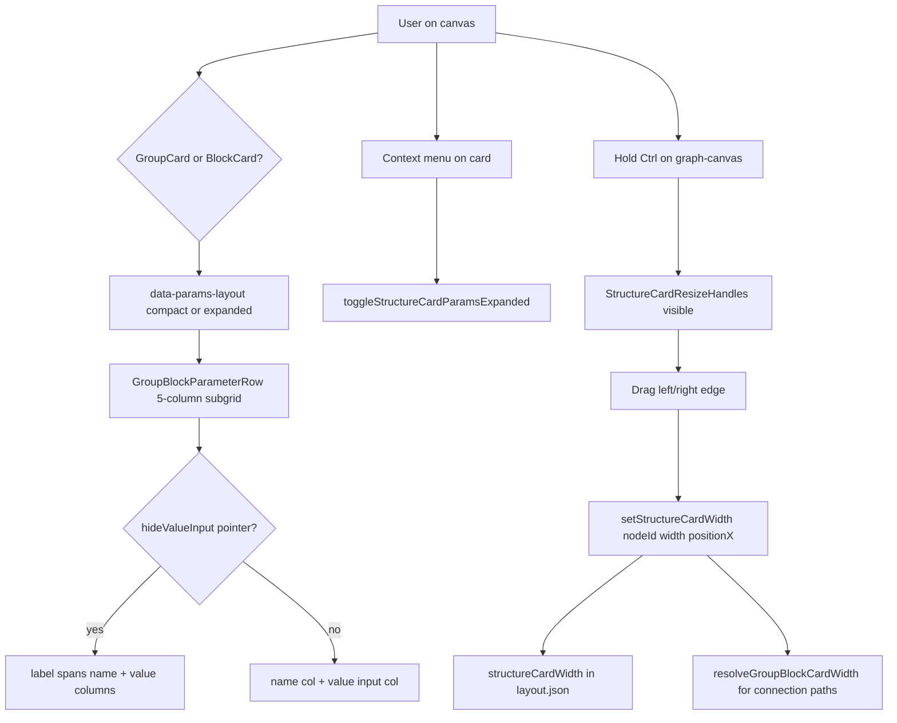
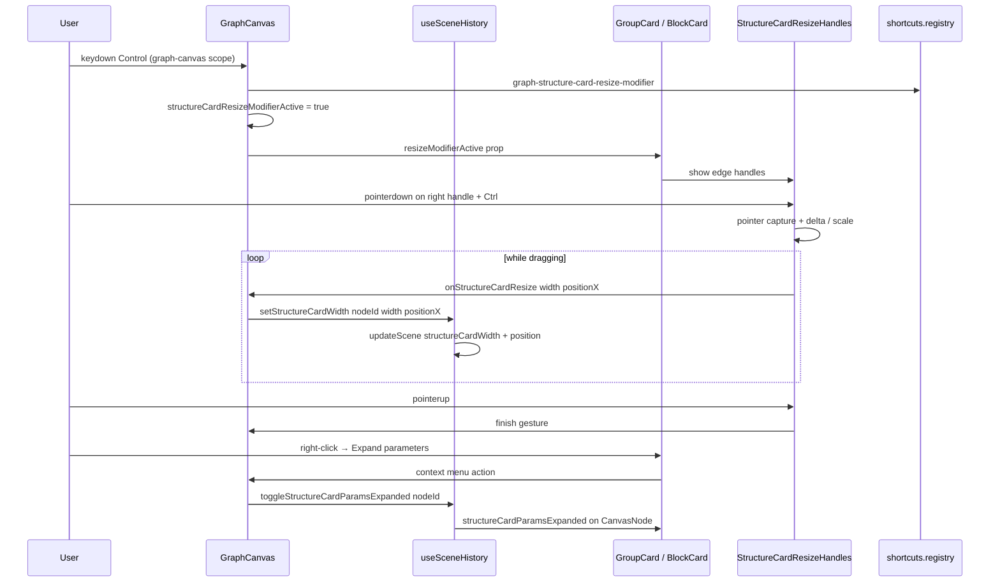

# Implementation Documentation — Structure card layout (Group / Block)

**Save location:** `feature_md/feature/feature-structure-card-layout.md`  
**README:** project index + [full implementation section](../../README.md#implementation--structure-card-layout-branch-featurestructure-card-layout)

---

## 1. Header / Cabeçalho

| Field | Value |
| --- | --- |
| Branch name | `feature-structure-card-layout` |
| Feature name | Group/Block structure card layout — compact grid, pointer rows, manual width resize |
| Version | `1.5.2` |
| Commit | `9d47450` |

---

## EN — English sections

### 2. Tag definitions and summary

| Tag | Definition |
| --- | --- |
| `[NEW]` | New module, component, CSS, shortcut binding, or persisted field. |
| `[UPDATED]` | Existing Group/Block card, canvas, slot geometry, or shortcut handler changed. |
| `[REMOVED]` | Deprecated auto-width observer removed in favour of explicit width model. |

Tags present in this implementation: `[NEW]`, `[UPDATED]`, `[REMOVED]`

### 3. Operation flowchart

### 4. Function activation sequence

### 5. Functions and components table

| Status | Name | Feature | Technical description | Parameters / return |
| --- | --- | --- | --- | --- |
| `[NEW]` | `structureCardLayout.ts` | Card metrics | Shared constants: header 36px, row 28px, divider 2px; `resolveGroupCardWidth` / `resolveBlockCardWidth`; clamp 360–720px | `CanvasNode` → `number` |
| `[NEW]` | `StructureCardResizeHandles.tsx` | Manual resize | Invisible 8px edge buttons; visible when Ctrl held; pointer drag adjusts width; left edge also shifts `position.x` | `onResize({ width, positionX })` |
| `[NEW]` | `GroupBlockParameterRow.module.css` | Parameter row | 5-column subgrid: slot \| icon \| name \| value \| slot; pointer rows span cols 3–4; Jade syntax token colours on label/inputs | CSS module |
| `[NEW]` | `shortcuts.registry.json` entries | Shortcut docs | `graph-structure-card-resize-modifier`, `-meta`, `graph-structure-card-resize` (pointer gesture doc) | JSON |
| `[UPDATED]` | `GroupCard.tsx` / `BlockCard.tsx` | Card shell | Fixed width from `structureCardWidth` (default 360); embed resize handles; pass `canvasScale` | React props |
| `[UPDATED]` | `GroupParameterRow.tsx` / `BlockParameterRow.tsx` | Row UI | `data-no-value` / `data-empty` for pointer parameters without value input | `hideValueInput` |
| `[UPDATED]` | `GraphCanvas.tsx` | Canvas integration | `onSetStructureCardWidth`; Ctrl modifier state; slot paths use `resolve*CardWidth` from node | callbacks |
| `[UPDATED]` | `useSceneHistory.ts` | Scene mutation | `setStructureCardWidth`, `toggleStructureCardParamsExpanded`; normalizes width (omit when 360) | `updateScene` |
| `[UPDATED]` | `canvasScene.ts` / `scenePresentation.ts` | Persistence | Fields `structureCardParamsExpanded`, `structureCardWidth` in layout export/import | v2 layout JSON |
| `[UPDATED]` | `groupSlotConnections.ts` / `blockSlotConnections.ts` | Slot geometry | `get*SlotPortYOffset` and `estimate*CardHeight` use `STRUCTURE_CARD_*` metrics | aligned to CSS |
| `[UPDATED]` | `useGraphCanvasShortcutHandlers.ts` | Ctrl modifier | Tracks Control/Meta keyup/keydown for resize handle visibility | `setStructureCardResizeModifierActive` |
| `[UPDATED]` | `canvasContextMenuItems.ts` | Context menu | Toggle compact/expanded params; hint row `Ctrl+arrastar` for resize | structure cards only |
| `[UPDATED]` | `tokens.css` | Design tokens | Compact row height 28px, header 36px, smaller field min-height and input font | CSS variables |
| `[REMOVED]` | `useStructureCardWidth.ts` | Auto width | ResizeObserver that stretched card to max-content — replaced by explicit width + manual resize | — |

### 6. Detailed behavior

**Default layout (compact):** Group and Block cards render a **5-column CSS subgrid** per parameter row: input slot, type icon, label, value field, output slot. Default card width is **360px** so name and value share space without forcing the card to grow with every label.

**Pointer parameters:** When `isGroupPointerSourcePath` / `isBlockPointerSourcePath` is true, the value column is hidden and the label spans columns 3–4 (`data-no-value="1"`), showing the full pointer structure name without truncation inside the fixed width.

**Expanded layout (context menu):** Right-click a structure card → **Expand parameters (full name)** toggles `structureCardParamsExpanded`. In expanded mode, name and value stack on two rows (cols 3–4) with word-wrap for long ritual names.

**Manual width resize:** Hold **Ctrl** (or **Cmd** on macOS) on the graph canvas — lateral resize handles appear on structure cards. Drag the **left or right edge** to set width between **360px and 720px**. Dragging the left edge keeps the right edge anchored by updating both `structureCardWidth` and `position.x`. Width persists per node in scene layout (`structureCardWidth`; omitted when default 360).

**Compact vertical density:** Header, divider, row padding, and input min-heights were reduced (header 36px, row ~28px, body padding 4px) so cards like `VfxEmitterDefinitionData` fit more parameters on screen. Slot Y offsets and marquee hit tests use the same metrics via `structureCardLayout.ts`.

**Syntax colours:** Parameter labels use `--syntax-property`; inputs use Jade syntax tokens (`--syntax-symbol`, etc.) via shared parameter input CSS — consistent with ritual nodes.

**Errors / guards:** Resize is disabled when the node is locked (`interactionLocked`). Width is clamped server-side in `clampStructureCardWidth`. Left-edge resize recalculates position from gesture start to avoid drift.

### 7. How to use (simple guide)

| Step | Action |
| --- | --- |
| 1 | Generate a **Group** or **Block** from the inspector (`Gerar Grupo` / `Gerar Bloco`) |
| 2 | Card shows parameters in a **compact single line** (name + value) at 360px width |
| 3 | **Pointer** rows (e.g. `VfxShapeCylinder`) show the full name across the value area |
| 4 | Right-click card → **Expand parameters** for two-line name + value layout |
| 5 | Hold **Ctrl**, drag **left/right edge** of the card to widen up to 720px |
| 6 | Save scene — custom width is restored on load |

---

## PT — Seções em português

### 2. Definição e resumo de tags

| Tag | Definição |
| --- | --- |
| `[NOVO]` | Novo módulo, componente, CSS, atalho ou campo persistido. |
| `[ATUALIZADO]` | Card Grupo/Bloco, canvas, geometria de slots ou atalhos alterados. |
| `[REMOVIDO]` | Observer de largura automática substituído por largura explícita + resize manual. |

Tags presentes: `[NOVO]`, `[ATUALIZADO]`, `[REMOVIDO]`

### 3. Fluxograma de funcionamento

Ver diagrama Mermaid na secção EN acima (mesma lógica).

### 4. Fluxograma de acionamento

Ver diagrama de sequência Mermaid na secção EN acima.

### 5. Tabela de funções e componentes

Ver tabela EN — coluna Status usa `[NOVO]` / `[ATUALIZADO]` / `[REMOVIDO]` equivalente a `[NEW]` / `[UPDATED]` / `[REMOVED]`.

### 6. Descrição detalhada

**Layout compacto:** Cards Grupo e Bloco usam grelha de **5 colunas** (slot entrada \| ícone \| nome \| valor \| slot saída). Largura padrão **360px** — compacta como no editor Jade, sem esticar o card só por causa do nome mais longo.

**Parâmetros pointer:** Sem campo de valor; o nome ocupa as colunas nome+valor para ser lido por completo dentro dos 360px.

**Modo expandido:** Menu de contexto no card → alternar entre linha única e **nome em cima + valor em baixo** (`structureCardParamsExpanded`).

**Alargar manualmente:** **Ctrl** pressionado no canvas → indicadores nas bordas laterais → **arrastar** para 360–720px. Borda esquerda move também a posição do nó. Largura guardada em `structureCardWidth` no layout da cena.

**Altura compacta:** Cabeçalho, linhas e inputs mais baixos (~28px por linha); slots de ligação alinhados via `structureCardLayout.ts`.

**Cores Jade:** Labels e inputs usam tokens `--syntax-*` do tema.

### 7. Como utilizar (guia simples)

| Passo | Acção |
| --- | --- |
| 1 | Gere um **Grupo** ou **Bloco** no inspetor |
| 2 | O card mostra parâmetros em **linha compacta** (360px) |
| 3 | Linhas **pointer** mostram o nome completo na zona do valor |
| 4 | Clique direito → **Expandir parâmetros** para nome + valor em duas linhas |
| 5 | Segure **Ctrl** e **arraste a borda lateral** para alargar até 720px |
| 6 | Guarde a cena — a largura personalizada é restaurada |

**Ficheiros principais:** `structureCardLayout.ts`, `StructureCardResizeHandles.tsx`, `GroupBlockParameterRow.module.css`, `GroupCard.tsx`, `BlockCard.tsx`, `GraphCanvas.tsx`, `useSceneHistory.ts`, `groupSlotConnections.ts`, `blockSlotConnections.ts`, `shortcuts.registry.json`.
