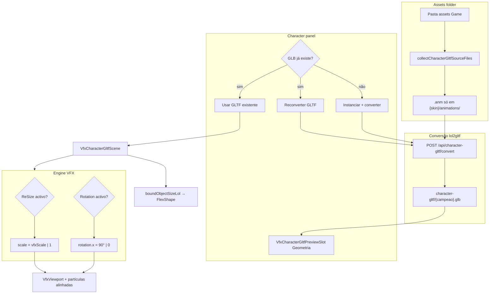
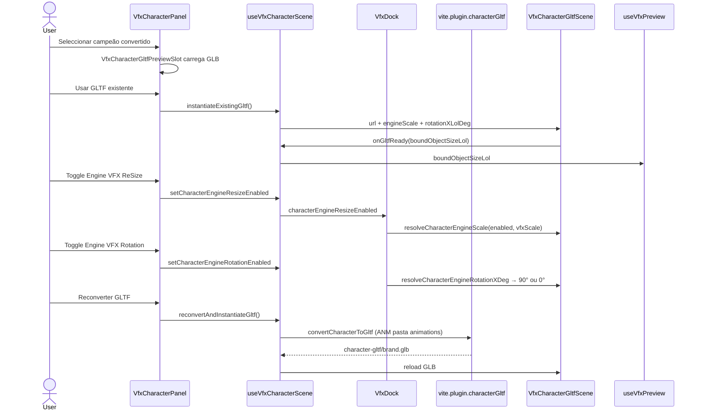

# Implementation Documentation — VFX Character GLTF Engine

File location: `feature_md/feature/feature-vfx-character-gltf-engine.md`

## 1. Header

| Field | Value |
| --- | --- |
| Branch Name | `feature-vfx-character-gltf-engine` |
| Feature Name(s) | VFX Character GLTF Pipeline · Engine VFX (ReSize + Rotation) · Character Panel UX |
| Current Version | `1.5.0` |
| Commit Hash | `1b6bc63` |

---

## 2. Tag Definition and Summary

| Tag | Definition |
| --- | --- |
| `[NOVO]` | New module, component, API endpoint, or behaviour that did not exist before. |
| `[ATUALIZADO]` | Existing file or API extended without removing the previous contract. |
| `[REMOVIDO]` | Removed code path, export, or UI entry. |

Tags present in this implementation:

- `[NOVO]`
- `[ATUALIZADO]`

---

## 3. Operation Flowchart



---

## 4. Function Activation Sequence Diagram



---

## 5. Functions and Components Table

| Status | Name | Feature | Technical Description | Parameters / Return |
| --- | --- | --- | --- | --- |
| `[NOVO]` | `lol2gltfRunner.mjs` | GLTF pipeline | Executa lol2gltf CLI; grava `character-gltf/{base}.glb`. | buffers SKN/SKL/ANM → GLB |
| `[NOVO]` | `vite.plugin.characterGltf.ts` | GLTF API | Dev-only: health, list, convert, serve GLB. | Vite plugin |
| `[NOVO]` | `characterGltfConvert.ts` | GLTF pipeline | `pickAnmFiles` — só `{skin}/animations/*.anm`. | champion, files → POST |
| `[NOVO]` | `characterGltfCatalog.ts` | GLTF catalog | Lista GLBs convertidos; `getGltfUrl`. | champion → URL |
| `[NOVO]` | `characterGltfClips.ts` | GLTF animation | Normaliza clips; stats; default idle/dance. | clips → names |
| `[NOVO]` | `characterGltfAnimations.ts` | GLTF animation | Lista nomes via GLTFLoader (sem instanciar). | champion → string[] |
| `[NOVO]` | `characterEngineVfx.ts` | Engine VFX | `resolveCharacterEngineScale`, `resolveCharacterEngineRotationXDeg` (90° fixo). | boolean → number |
| `[NOVO]` | `getBoundObjectSizeLolFromObject3D` | FlexShape bound | AABB Three → unidades LoL / engineScale. | Object3D, scale → vec3 |
| `[NOVO]` | `collectCharacterGltfSourceFiles` | Asset collect | SKN/SKL/tex skin + ANM só pasta animations. | handle, champion → File[] |
| `[NOVO]` | `VfxCharacterGltfScene.tsx` | Viewport character | GLTFLoader + AnimationMixer + group scale/rotation. | engineScale, rotationXLolDeg |
| `[NOVO]` | `VfxCharacterGltfPreviewSlot.tsx` | Geometria preview | Canvas 3D no painel Info (pré-instanciar). | url, flags Engine VFX |
| `[NOVO]` | `useVfxCharacterScene.ts` | Character state | Catálogo, instanciar/reconverter, Engine VFX toggles, bound. | hook API |
| `[NOVO]` | `VfxCharacterPanel.tsx` | Character UI | Campeões colapsáveis, Geometria GLTF, Engine VFX checkboxes. | scene, vfxScale |
| `[ATUALIZADO]` | `VfxDock.tsx` | Wiring | Passa engineScale/rotation e boundObjectSizeLol ao preview VFX. | character props |
| `[ATUALIZADO]` | `VfxViewport.tsx` | Viewport | Props Engine VFX para `VfxCharacterGltfScene`. | character |
| `[ATUALIZADO]` | `VfxToolsDock.tsx` | Tools dock | Passa `vfxScale` ao painel Character. | vfxScale |
| `[ATUALIZADO]` | `vfxViewportPreferences.ts` | Ground default | Chão padrão **11×11** (era 20×20). | groundScale2d |
| `[ATUALIZADO]` | `vfxCharacterAssets.ts` | Paths | Helpers pasta `animations/` por skin. | champion, skin |
| `[ATUALIZADO]` | `language/*.json` | i18n | LangIds 368–433 (Character + Engine VFX). | — |

---

## 6. Detailed Operation Description

### Architecture

Characters are converted offline in dev via **lol2gltf** into `character-gltf/{campeao}.glb` (no `gltf_` prefix). The Vite plugin exposes REST endpoints only during `pnpm dev`. The viewport renders via **React Three Fiber** (`VfxCharacterGltfScene`) with `SkeletonUtils.clone` for skinning.

**Engine VFX** aligns the character mesh with the particle pipeline: when **Character ReSize** is on, the root group scales by timeline `vfxScale` (default 0.01); when off, scale is 1. When **Character Rotation** is on, a fixed **90°** rotation is applied on **Three X** (LoL X); when off, rotation is 0 (bind pose orientation).

`boundObjectSizeLol` is computed from the GLTF AABB and feeds existing **FlexShape** multipliers in `vfxTransformEngine` / `useVfxPreview`.

### Business rules

- Animation files for conversion: **only** `characters/{campeao}/{skin}/animations/*.anm` (same skin as SKN).
- If GLB already exists: panel offers **Usar GLTF existente** or **Reconverter** inside **Campeões** (not auto-load).
- Champion list expands **only** when search is focused; collapses on selection.
- **Sync with VFX timeline** (animations): default **off**.
- Ground default size: **11 × 11** in viewport preferences.
- Engine VFX controls are **checkboxes only** (no numeric fields in UI).

### Errors / edge cases

- `LOL2GLTF_NOT_FOUND` if `tools/lol2gltf/lol2gltf.exe` missing — see `LEIA-ME.txt`.
- Conversion API unavailable outside `pnpm dev`.
- Empty animations folder → convert error with path hint.
- Rotation checkbox only fixes orientation around X; other axes need future work if GLTF export is lying down.

---

## How to use (EN)

1. Install **lol2gltf** in `tools/lol2gltf/` (see `LEIA-ME.txt`) and run **`pnpm dev`**.
2. VFX dock → **Character** tool → set **Assets path** to your Game folder (e.g. custom skin `assets`).
3. Select a champion. If **Geometria** shows GLTF preview, a converted GLB exists.
4. **Campeões**: use **Usar GLTF existente** or **Reconverter**; otherwise **Instanciar** converts first.
5. **Render → Engine VFX**: toggle **Character ReSize** (sync `vfxScale`) and **Character Rotation** (90° X) to align with VFX particles.
6. **Animações**: pick clip; optional **Sync with VFX timeline** links pose to timeline playhead.

---

## Como usar (PT)

1. Instale o **lol2gltf** em `tools/lol2gltf/` (ver `LEIA-ME.txt`) e execute **`pnpm dev`**.
2. Dock VFX → ferramenta **Character** → defina **Assets path** para a pasta Game (ex.: `assets` do skin custom).
3. Seleccione um campeão. Se **Geometria** mostrar preview GLTF, já existe GLB convertido.
4. **Campeões**: **Usar GLTF existente** ou **Reconverter**; senão **Instanciar** converte primeiro.
5. **Render → Engine VFX**: active **Character ReSize** (escala = vfxScale da timeline) e **Character Rotation** (90° no eixo X) para alinhar com as partículas VFX.
6. **Animações**: escolha o clip; **Sync with VFX timeline** (desligado por defeito) liga a pose à timeline.

### Tests

```bash
pnpm test -- src/core/vfx/characterGltfConvert.test.ts src/core/vfx/characterEngineVfx.test.ts src/core/vfx/vfxCharacterBounds.test.ts src/core/vfx/characterGltfCatalog.test.ts
```

---

## Acknowledgements

Special thanks to **Bud**, creator of the Jade tool that powers the BIN conversion system used in this project.
GitHub: https://github.com/budlibu500

Key contributions include:

* BIN code conversion
* BIN League syntax analysis
* Particle editing systems
* General-purpose editing tools

Their work and support were essential to the development and functionality of this project.
