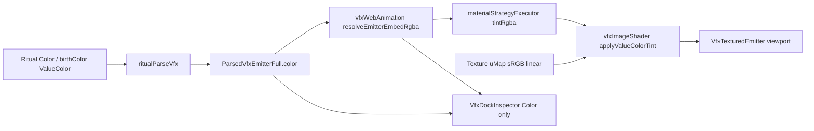
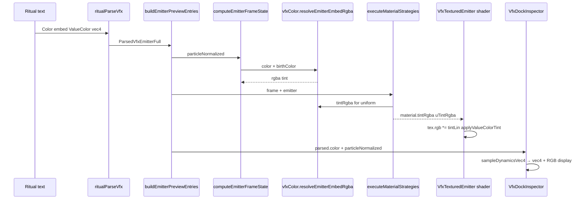

# Implementation Documentation — VFX Color system (ValueColor × textures)

**Save location:** `feature_md/feature/feature-vfx-color-system.md`  
**README:** project index + [implementation section](../../README.md#implementation--vfx-color-system-branch-featurevfx-color-system) (per `feature_md/prompet/prompt_doc.md`).

---

## 1. Header / Cabeçalho

| Field | Value |
| --- | --- |
| Branch name | `feature/vfx-color-system` |
| Feature name | VFX Color — ValueColor (`vec4`) mixing in shader + inspector |
| Version | `1.5.0` |
| Commit | `412a33f` |

---

## EN — English sections

### 2. Tag definitions and summary

| Tag | Definition |
| --- | --- |
| `[NEW]` | New module, component, function, or UI created in this branch. |
| `[UPDATED]` | Existing VFX pipeline changed to use centralized color math or new uniforms. |
| `[REMOVED]` | Behavior or UI removed (e.g. fixed `mix(0.65)` heuristic, inspector texture swatches). |

Tags present in this implementation: `[NEW]`, `[UPDATED]`

### 3. Operation flowchart



### 4. Function activation sequence



### 5. Functions and components table

| Status | Name | Feature | Technical description | Parameters / return |
| --- | --- | --- | --- | --- |
| `[NEW]` | `vfxColor.ts` | VFX Color core | `normalizeVec4Tuple`, `multiplyRgba`, `resolveEmitterEmbedRgba`, `composeEmitterDisplayRgba` | `VfxRgbaTuple`, `VfxEmbedValue` |
| `[NEW]` | `vfxColor.test.ts` | Tests | Unit tests for multiply, Brand fade, compose | — |
| `[NEW]` | `vfxTextureColorSample.ts` | CPU color sample | Dominant RGBA from image pixels (optional / tests) | `ImageData`, URLs |
| `[NEW]` | `useVfxTextureColorSample.ts` | Hook | Async texture sampling for tooling (inspector no longer uses it) | emitter, URLs |
| `[NEW]` | `VfxColorSwatchRow.tsx` | Inspector UI | Swatch + `vec4:` + `RGB:` labels | `rgba: VfxRgbaTuple` |
| `[NEW]` | `VfxDockInspector` color section | Inspector | Shows **only** `Color` embed at current timeline `t` | `particleNormalized` |
| `[UPDATED]` | `vfxEmbedSample.ts` | Embed sampling | `embedVec4`, `sampleDynamicsVec4` shared with vec3 | embed, `t` → `[r,g,b,a]` |
| `[UPDATED]` | `vfxWebAnimation.ts` | Frame state | Uses `resolveEmitterEmbedRgba` instead of local vec4 | → `frame.color` |
| `[UPDATED]` | `vfxImageShader.ts` | GPU tint | `uTintRgba`, `applyValueColorTint` (linear), `blendParticleColor` multiply | uniforms |
| `[UPDATED]` | `vfxWebMaterials.ts` | Materials | `tintRgba`, `colorMultiply`; emissive `×1` on alpha blend | `blendMode` |
| `[UPDATED]` | `materialStrategyExecutor.ts` | Descriptor | Passes `tintRgba` from embed × frame | `ShaderMaterialDescriptor` |
| `[UPDATED]` | `VfxTexturedEmitter.tsx` | Render | `uTintRgba`, `uColorMultiply`, `toneMapped: false` | material |
| `[UPDATED]` | `VfxDock.tsx` | Dock | Passes `particleNormalized` to inspector | — |
| `[UPDATED]` | `ritualParseVfx.ts` | Parse | `colorRenderFlags: u8` | emitter |
| `[UPDATED]` | `vfxModel.ts` | Model | `colorRenderFlags` field | — |
| `[UPDATED]` | `vfxCoverageMatrix.ts` | Coverage | `colorRenderFlags`, `particleColorTexture` partial animation | — |
| `[REMOVED]` | Shader `mix(colorTex, 0.65)` | Color texture | Replaced by component-wise multiply when `uColorMultiply` | — |
| `[REMOVED]` | Inspector birthColor / texture swatches | Inspector UI | Only `Color` embed shown | — |

### 6. Detailed behavior

**ValueColor** in ritual uses `constantValue: vec4 = { r, g, b, a }` with optional `VfxAnimatedColorVariableData` (`list[vec4]` keyframes). Values are normalized 0–1 (or auto-detected 0–255 in `normalizeVec4Tuple`).

**CPU path:** `Color × birthColor` via component-wise multiply (`resolveEmitterEmbedRgba`), sampled over particle lifetime in `computeEmitterFrameState`.

**GPU path:** After main / `particleColorTexture` / palette / `textureMult` layers, `applyValueColorTint` multiplies texture RGB by tint in **linear** space (`srgbToLinear` on ritual tint). **Emissive boost (`×8`)** applies only for additive blend modes so alpha particles keep hue (e.g. yellow × cyan → green, not clipped to yellow).

**`colorRenderFlags & 1`:** enables multiply mode for `particleColorTexture` (replaces fixed 0.65 mix).

**Inspector:** section **Cor** shows only the active `Color` embed: preview swatch, `vec4: 0.55, 0.95, 1, 1`, `RGB: 140, 242, 255, 255`. Animated colors show timeline `t` in subtitle.

**Errors / edge cases:** Missing `Color` → inspector shows `—`; no tint → shader uses white `(1,1,1,1)` from dynamics fallback.

### 7. How to use (simple guide)

| Goal | What to do |
| --- | --- |
| See tint in 3D | Open **VFX dock**, select emitter, **Rebuild** + **Play**; ritual must include `Color: embed = ValueColor { constantValue: vec4 = { … } }` |
| Yellow shape + cyan tint → green | On the **same emitter** that draws the yellow sprite, set `Color` to cyan `(0.55, 0.95, 1, 1)` — GPU does `texture.rgb × Color` per pixel |
| Inspect Color only | VFX inspector → section **Cor** → read `vec4` and `RGB` (updates with timeline for animated `Color`) |
| birthColor | Still applied in render (`× birthColor`); not shown in inspector (only `Color` per request) |

---

## PT — Secções em português

### 2. Definição e resumo de tags

| Tag | Definição |
| --- | --- |
| `[NOVO]` | Novo módulo, componente, função ou UI criado nesta branch. |
| `[ATUALIZADO]` | Pipeline VFX existente alterado para matemática de cor centralizada ou novos uniforms. |
| `[REMOVIDO]` | Comportamento ou UI removido (ex.: heurística `mix(0.65)`, swatches de textura no inspector). |

Tags presentes: `[NOVO]`, `[ATUALIZADO]`

_(Diagramas Mermaid das secções 3 e 4 são os mesmos acima.)_

### 6. Funcionamento detalhado

O ritual define **`Color`** e opcionalmente **`birthColor`** como `ValueColor` com `vec4` (0–1 ou 0–255). O módulo [`vfxColor.ts`](../../src/core/vfx/vfxColor.ts) concentra multiplicação, normalização e resolução `Color × birthColor`.

No **render**, a textura da partícula é multiplicada pelo tint no shader (`applyValueColorTint`) em espaço linear. O boost de emissão **só em blend additive** evita saturar o RGB em modo alpha (antes `×3` cortava o verde ao misturar amarelo × ciano).

**`particleColorTexture`** usa multiply real em vez de `mix` fixo 0.65 quando `colorRenderFlags & 1`.

**Inspector:** apenas o embed **`Color`** — quadrado de cor, linha **vec4** e linha **RGB**.

### 7. Como utilizar (guia simples)

| Objectivo | O que fazer |
| --- | --- |
| Ver cor no viewport | Menu **VFX** → emitter com `Color` no ritual → **Rebuild** → **Play** |
| Amarelo × ciano = verde | No emitter do sprite amarelo, `Color` com valores ciano; a mistura é **por pixel** na mesma partícula |
| Ver valores no inspector | Secção **Cor** → `vec4` normalizado + `RGB` 0–255 |
| Cor animada | Com `dynamics` em `Color`, mover a timeline — o inspector actualiza `t` |

---

## Main files / Ficheiros principais

- `src/core/vfx/vfxColor.ts`, `vfxEmbedSample.ts`, `vfxWebAnimation.ts`, `vfxImageShader.ts`
- `src/core/vfx/semantic/executors/materialStrategyExecutor.ts`, `vfxWebMaterials.ts`
- `src/core/vfx/ritualParseVfx.ts`, `vfxModel.ts`, `vfxCoverageMatrix.ts`
- `src/components/organisms/VfxTexturedEmitter.tsx`, `VfxDockInspector.tsx`, `VfxDock.tsx`
- `src/components/molecules/VfxColorSwatchRow.tsx`

**Tests:**

```bash
npm test -- src/core/vfx/vfxColor.test.ts src/core/vfx/vfxEmbedSample.test.ts src/core/vfx/vfxAuditFeatures.test.ts src/core/vfx/semantic/executors/materialStrategyExecutor.test.ts
```
