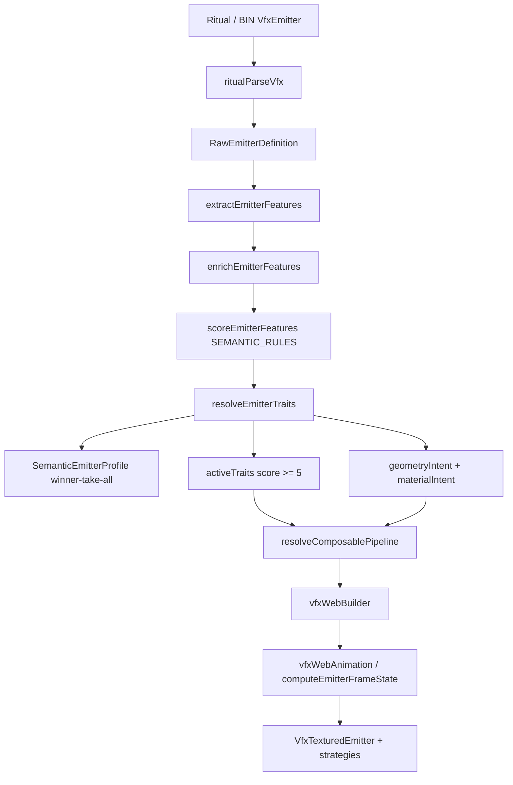
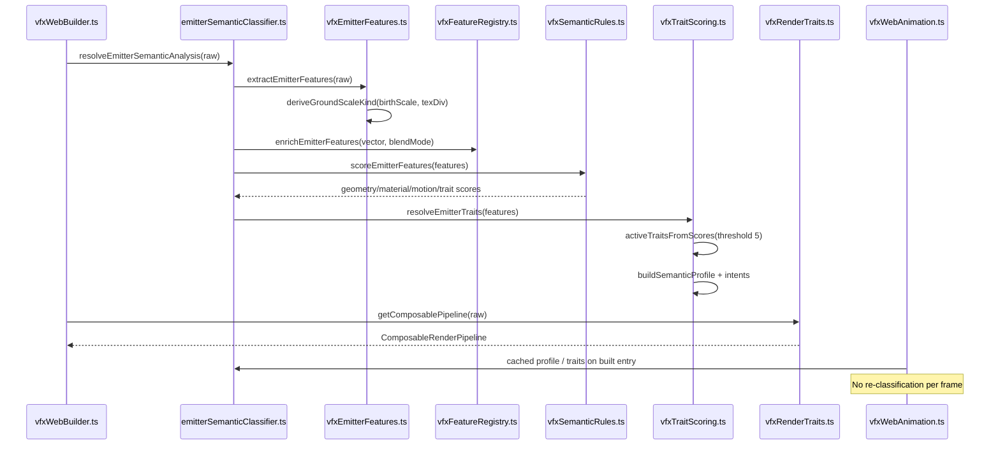

# Implementation Documentation — VFX Emitter Classifications Reference

**Save location:** `feature_md/feature/feature-vfx-emitter-classifications.md`  
**Branch file name:** `feature-vfx-emitter-classifications.md`

---

## 1. Header

| Field | Value |
| --- | --- |
| Branch Name | `feature-vfx-emitter-classifications` |
| Feature Name(s) | VFX Emitter Classifications Reference (semantic taxonomy & pipeline catalog) |
| Current Version | `1.5.0` |
| Commit Hash | `62bd3ec` |

---

## 2. Tag Definition and Summary

| Tag | Definition |
| --- | --- |
| `[NOVO]` | New module, component, endpoint, or behaviour that did not exist before. |
| `[ATUALIZADO]` | Existing file or API extended without removing the previous contract. |
| `[REMOVIDO]` | Removed code path, export, or UI entry. |

**Tags present in this implementation:** `[NOVO]`

---

## 3. Operation Flowchart

---

## 4. Function Activation Sequence Diagram

---

## 5. Functions and Components Table

| Status | Name | Feature | Technical Description | Parameters / Return |
| --- | --- | --- | --- | --- |
| `[NOVO]` | `feature-vfx-emitter-classifications.md` | Documentation | Full English implementation doc + taxonomy appendix; complements `feature-vfx-semantic-classifier.md` and `feature-vfx-render-traits.md` | Markdown reference |
| — | `resolveEmitterSemanticAnalysis` | Semantic classifier | Cached WeakMap analysis: trait scores, active traits, profile, intents | `RawEmitterDefinition` → `ResolvedEmitterTraits` |
| — | `classifyEmitter` | Semantic classifier | Legacy winner-take-all profile (geometry / material / motion) | `raw` → `SemanticEmitterProfile` |
| — | `getEmitterActiveTraits` | Render traits | Multi-label traits with score ≥ `TRAIT_ACTIVATION_THRESHOLD` (5) | `raw` → `RenderTraitId[]` |
| — | `extractEmitterFeatures` | Feature extraction | Parses scale, blend, UV, primitive, motion flags from ritual emitter | `raw` → `EmitterFeatureVector` |
| — | `deriveGroundScaleKind` | Ground scale | Classifies birthScale + texDiv into decal / flipbookSquare / strip / neutral | `vec3`, `texDiv?` → `LoLGroundQuadScaleKind` |
| — | `enrichEmitterFeatures` | Feature registry | Adds `isDecalLike`, `isBeamLike`, `isRingLike`, blendMode | `vector`, `blendMode` → `EmitterFeatures` |
| — | `scoreEmitterFeatures` | Semantic rules | Applies `SEMANTIC_RULES` weighted scoring | `EmitterFeatures` → score maps |
| — | `resolveEmitterTraits` | Trait scoring | Builds profile + active traits + intents | `EmitterFeatures` → `ResolvedEmitterTraits` |
| — | `resolveGeometryIntent` | Geometry intent | Structural intent for Three.js kind (Decal, Beam, Trail, …) | `EmitterFeatures` → `GeometryIntent` |
| — | `resolveMaterialIntent` | Material intent | Energy / SoftAlpha / Dissolve / … for placeholder color | `EmitterFeatures` → `MaterialIntent` |
| — | `getComposablePipeline` | Render pipeline | Composes geometry/material/motion strategy IDs from traits | `raw` → `ComposableRenderPipeline` |
| — | `VfxTransformDebug` | Debug UI | Shows top traits, intents, ground scale kind when enabled | `entry`, settings |

*(Rows marked `—` document existing modules catalogued by this reference; they were introduced in earlier VFX semantic phases.)*

---

## 6. Detailed Description (English)

This feature is a **reference documentation** artifact for the VFX semantic classification system already implemented under `src/core/vfx/semantic/`. The engine infers **which render pipeline to apply** from structural BIN/ritual signatures (scale, `blendMode`, `texDiv`, primitive kind, motion flags, ground layer, navmesh mask, etc.) — **without** using champion name, emitter name, or texture asset paths.

### Architecture (three layers)

1. **Parsing** — `ritualParseVfx` → `RawEmitterDefinition`
2. **Semantic analysis** — features → weighted rules → profile + multi-label traits + intents
3. **Render** — `ComposableRenderPipeline` → `vfxWebBuilder` / `vfxWebAnimation` / material & geometry executors

### Classification outputs

| Layer | Type | Role |
| --- | --- | --- |
| Profile (per axis) | `GeometrySemanticKind`, `MaterialSemanticKind`, `MotionSemanticKind` | One winner per axis with score and reasons |
| Ground scale | `LoLGroundQuadScaleKind` | `decal` \| `flipbookSquare` \| `strip` \| `neutral` |
| Traits | `RenderTraitId[]` | Composable multi-label (e.g. `GroundProjected` + `FlipbookAnimated`) |
| Intents | `GeometryIntent`, `MaterialIntent` | Structural labels for Three.js + placeholder materials |
| Strategies | `GeometryStrategyId`, `MaterialStrategyId`, `MotionStrategyId` | Modular executors in the composable pipeline |

### Business rules

- Trait activation threshold: **score ≥ 5** (`TRAIT_ACTIVATION_THRESHOLD`).
- Classification is **cached** on `RawEmitterDefinition` via `WeakMap` — not recomputed every frame after scene build.
- Heuristic rules live in `SEMANTIC_RULES` (`vfxSemanticRules.ts`); adding a rule updates scores without renaming emitters.
- `Unknown` kinds are fallbacks when no rule dominates an axis.

### Errors / edge cases

- No user-facing errors are thrown by the classifier; failed or sparse BIN fields yield low scores and `Unknown` / empty trait lists.
- Confidence on `SemanticEmitterProfile` is derived from top axis scores (capped at 1).
- Debug labels in the viewport depend on `showTransformDebug` in VFX Dock settings.

### Related documentation

- [feature-vfx-semantic-classifier.md](feature-vfx-semantic-classifier.md) — Phase 1 overview  
- [feature-vfx-render-traits.md](feature-vfx-render-traits.md) — Phase 2 traits & composable pipeline  
- [feature-vfx-ground-quad-transform.md](feature-vfx-ground-quad-transform.md) — Ground scale remap behaviour  

---

## 7. How to Use the New Features (English)

| Step | Action |
| --- | --- |
| 1 | Open this file: `feature_md/feature/feature-vfx-emitter-classifications.md` |
| 2 | Use **Appendix A** below as the single taxonomy table when debugging or extending `SEMANTIC_RULES` |
| 3 | In the app: open a VFX scene → VFX Dock → enable **Debug transform** → select an emitter to see traits, geometry/material kinds, and `groundScaleKind` |
| 4 | Run `npm test -- src/core/vfx/semantic` to validate classifier behaviour |
| 5 | Run `npm run vfx:audit-semantics` for offline audit of emitter signatures across fixtures |

**Tip:** Compare viewport debug output with rule IDs in Appendix B (e.g. `ground_decal`, `beam_ray`, `navmesh_ground_clip`).

---

## 8. Detailed Description (Português)

Esta feature é um **documento de referência** para o sistema de classificação semântica VFX já implementado em `src/core/vfx/semantic/`. O motor infere **qual pipeline de renderização aplicar** a partir da assinatura estrutural do emitter no BIN/ritual — **sem** usar nome do campeão, nome do emitter ou caminho de textura.

### Arquitectura (três camadas)

1. **Parsing** — ritual → `RawEmitterDefinition`
2. **Análise semântica** — features → regras com pesos → perfil + traits multi-label + intents
3. **Render** — pipeline composto → builder / animation / executores

### Saídas de classificação

| Camada | Tipo | Função |
| --- | --- | --- |
| Perfil (por eixo) | `GeometrySemanticKind`, `MaterialSemanticKind`, `MotionSemanticKind` | Um vencedor por eixo com score |
| Escala ground | `LoLGroundQuadScaleKind` | `decal`, `flipbookSquare`, `strip`, `neutral` |
| Traits | `RenderTraitId[]` | Vários traits activos em simultâneo |
| Intents | `GeometryIntent`, `MaterialIntent` | Rótulos estruturais para Three.js |
| Estratégias | IDs de geometry/material/motion | Módulos composáveis no pipeline |

### Regras de negócio

- Threshold de traits: **score ≥ 5**.
- Classificação em **cache** (`WeakMap`) após build da cena.
- Regras em `SEMANTIC_RULES`; novas heurísticas não exigem renomear emitters.

### Erros / casos limite

- Classificador não lança erros ao utilizador; dados incompletos → `Unknown` ou traits vazios.
- Debug no viewport requer **Debug transform** activo no VFX Dock.

---

## 9. Como Utilizar as Novas Funcionalidades (Português)

| Passo | Acção |
| --- | --- |
| 1 | Abra `feature_md/feature/feature-vfx-emitter-classifications.md` |
| 2 | Consulte o **Apêndice A** para a taxonomia completa ao depurar ou alterar regras |
| 3 | Na app: cena VFX → VFX Dock → active **Debug transform** → seleccione um emitter |
| 4 | Execute `npm test -- src/core/vfx/semantic` |
| 5 | Execute `npm run vfx:audit-semantics` para auditoria offline |

**Dica:** Cruze o debug do viewport com os IDs de regras no Apêndice B.

---

## 10. Test Plan

| Check | Status |
| --- | --- |
| Vitest `emitterSemanticClassifier.test.ts` | Existing |
| Vitest `vfxTraitScoring.test.ts` | Existing |
| Vitest `vfxRenderTraits.test.ts` | Existing |
| `npm run vfx:audit-semantics` | Existing |
| Documentation structure matches `prompt_doc.md` | Done |
| Visual validation: debug labels vs taxonomy | Manual |

---

## Appendix A — Full taxonomy (English)

### A.1 Geometry (`GeometrySemanticKind`)

| Kind | Typical signals |
| --- | --- |
| `GroundDecal` | Ground + arbitrary quad + flat + two large axes |
| `GroundRing` | Ground + flipbook + dominant axis, or strip on ground |
| `Billboard` | Billboard candidate, camera-facing |
| `DirectionBillboard` | Direction-oriented + velocity-aligned |
| `Ribbon` | Strip-like ground quad |
| `Beam` | `primitiveRay` / beam / extreme length axis |
| `Mesh` | Mesh primitive or mesh asset |
| `Trail` | `primitiveTrail` |
| `Shockwave` | `planeFacing === 'shockwave'` |
| `Unknown` | No dominant rule |

### A.2 Material (`MaterialSemanticKind`)

`Flipbook`, `Noise`, `Erosion`, `Distortion`, `Mask`, `Gradient`, `Flow`, `Solid`, `Unknown`

### A.3 Motion (`MotionSemanticKind`)

`Static`, `VelocityAligned`, `Orbiting`, `Scrolling`, `Rotating`, `Expanding`, `Unknown`

### A.4 Ground quad scale (`LoLGroundQuadScaleKind`)

| Kind | Meaning |
| --- | --- |
| `decal` | Two large similar axes + thin thickness (e.g. cracks2) |
| `flipbookSquare` | Multi-cell `texDiv` or `{L,1,1}` scale pattern |
| `strip` | One dominant elongated axis |
| `neutral` | Balanced proportions |

### A.5 Render traits (`RenderTraitId`)

`GroundProjected`, `FlipbookAnimated`, `AdditiveBlended`, `AlphaBlended`, `DirectionOriented`, `ErosionDissolve`, `UvScrollFlow`, `PaletteGradient`, `TextureMultLayered`, `BeamExtruded`, `TrailRibbon`, `BillboardCamera`, `SoftParticle`, `ShockwaveRadial`, `MeshBased`, `OrbitalMotion`, `RotationalSpin`, `VelocityMotion`, `NavmeshGroundClip`, `DistortionWarp`, `DepthBiasedDecal`, `GroundAlignedOrientation`, `ContinuousSpin`, `BoneAttachedSimulation`, `LocalParticleOrientation`

### A.6 Geometry intent (`GeometryIntent`)

`Decal`, `Ring`, `Beam`, `Trail`, `Shockwave`, `Mesh`, `Ribbon`, `Billboard`, `Unknown`

### A.7 Material intent (`MaterialIntent`)

| Intent | Heuristic |
| --- | --- |
| `Dissolve` | Erosion |
| `GradientTint` | Palette gradient |
| `Layered` | Texture mult |
| `Energy` | Additive + flipbook/scroll (or additive alone) |
| `SoftAlpha` | Alpha + huge particle |
| `Solid` | Default |

### A.8 Pipeline strategies

- **Scale:** `remapGroundDecal`, `remapFlipbookSquare`, `preserveLoL`, `fixBillboardZeroAxis`
- **Geometry:** `groundQuadRemapDecal`, `groundQuadRemapFlipbookSquare`, `groundQuadPreserveScale`, `billboardZeroAxis`, `preserveScale`
- **Material:** `flipbookUv`, `erosionMap`, `additiveEmissive`, `alphaTestCutoff`, `paletteLookup`, `uvScrollMult`, `softAlphaBlend`, `distortionMap`, `groundNavmeshClip`, `depthBiasPolygonOffset`
- **Motion:** `velocityAlignedRotation`, `orbitalOffset`, `rotationalSpin`, `staticGround`, `directionalVelocity`, `groundNavmeshSnap`

### A.9 BIN primitive (`EmitterPrimitiveGeometryKind`)

`plane`, `planar`, `beam`, `trail`, `ray`, `sphere`, `cylinder`, `ring`, `mesh`

### A.10 Examples

| Signature | Typical result |
| --- | --- |
| `isGroundLayer` + `arbitrary_quad` + `{55,600,600}` | `GroundDecal`, `decal` |
| `isGroundLayer` + flipbook + `{300,1,1}` + `texDiv` | `GroundRing`, `flipbookSquare` |
| `primitiveKind=ray` | `Beam`, `BeamExtruded` |
| `useNavmeshMask` + ground | `NavmeshGroundClip` |

**Source of truth:** `src/core/vfx/semantic/vfxSemanticTypes.ts`

---

## Appendix B — `SEMANTIC_RULES` rule IDs

`ground_decal`, `ground_ring_flipbook`, `ground_ring_strip`, `spark_direction_billboard`, `direction_billboard`, `beam_ray`, `beam_extreme_axis`, `trail_primitive`, `shockwave_facing`, `mesh_asset`, `billboard_default`, `material_flipbook`, `material_erosion`, `material_gradient`, `material_flow`, `trait_additive`, `trait_alpha`, `trait_soft_huge`, `trait_texture_mult`, `motion_orbital`, `motion_rotating`, `motion_velocity`, `ground_static`, `navmesh_ground_clip`, `distortion_warp`, `depth_biased_decal`, `ground_aligned_orientation`, `continuous_spin`, `bone_attached_sim`, `local_particle_orientation`

---

## Acknowledgements

Special thanks to **Bud**, creator of the Jade tool that powers the BIN conversion system used in this project.  
GitHub: https://github.com/budlibu500

Key contributions include BIN code conversion, BIN League syntax analysis, particle editing systems, and general-purpose editing tools. Their work was essential to ritual parsing and VFX semantic classification in this project.
