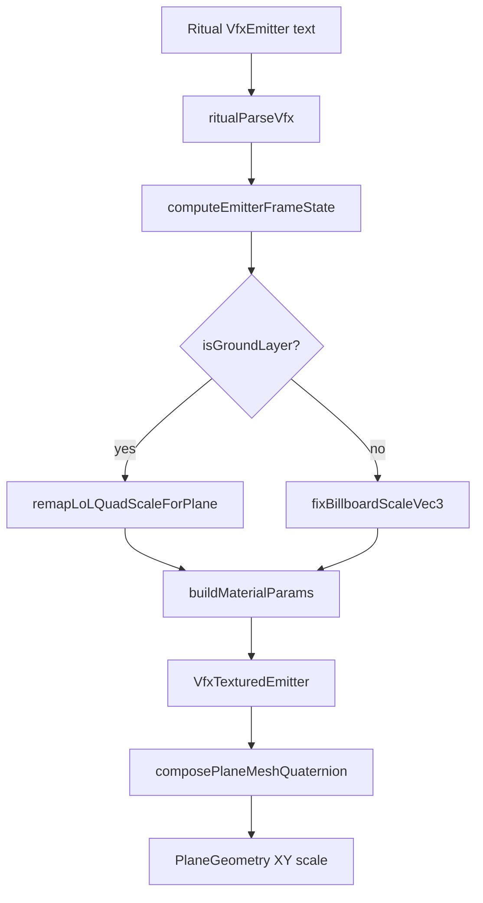
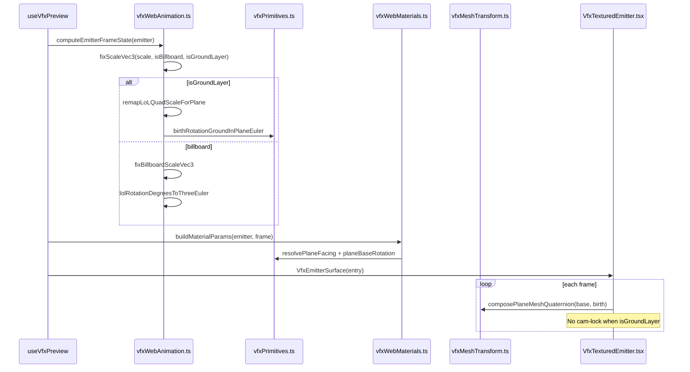

# Implementation Documentation — VFX Ground Quad Transform Pipeline

**Save location:** `feature_md/feature/feature-vfx-ground-quad-transform.md`  
**Branch file name:** `feature-vfx-ground-quad-transform.md`

---

## 1. Header

| Field | Value |
| --- | --- |
| Branch Name | `feature-vfx-ground-quad-transform` |
| Feature Name(s) | VFX Ground Quad Transform Pipeline (ArbitraryQuad / ground decals) |
| Current Version | `1.5.0` |
| Commit Hash | `b2ea03b` |

---

## 2. Tag Definition and Summary

| Tag | Definition |
| --- | --- |
| `[NOVO]` | New module, component, endpoint, or behaviour that did not exist before. |
| `[ATUALIZADO]` | Existing file or API extended without removing the previous contract. |
| `[REMOVIDO]` | Removed code path, export, or UI entry. |

**Tags present in this implementation:** `[NOVO]`, `[ATUALIZADO]`

---

## 3. Operation Flowchart

---

## 4. Function Activation Sequence Diagram

---

## 5. Functions and Components Table

| Status | Name | Feature | Technical Description | Parameters / Return |
| --- | --- | --- | --- | --- |
| `[NOVO]` | `remapLoLQuadScaleForPlane` | Ground scale | Smallest LoL axis → thickness (Z=1); two largest → plane width/height | `vec3` → `vec3` |
| `[NOVO]` | `birthRotationGroundInPlaneEuler` | Ground rotation | Skips “lay flat” euler; only in-plane spin (LoL Z → Three Y) | `birthRot`, `rotVel`, `time` → euler rad |
| `[NOVO]` | `composePlaneMeshQuaternion` | Mesh transform | Quaternion composition base × birth (replaces Euler sum) | `planeBase`, `birth` → `Quaternion` |
| `[NOVO]` | `eulerRadiansToQuaternion` | Mesh transform | Helper for R3F mesh rotation | `euler` → `Quaternion` |
| `[NOVO]` | `VfxTransformDebug` | Debug viewport | AxesHelper + wireframe scale box per emitter | `entry` |
| `[NOVO]` | `vfxWebAnimation.ground.test.ts` | Tests | Golden cases: cracks2, END_Ground_Core, Splat, hoop | Vitest |
| `[ATUALIZADO]` | `fixScaleVec3` | Animation | Third arg `isGroundLayer`; ground path before billboard | `scale`, flags → `vec3` |
| `[ATUALIZADO]` | `computeEmitterFrameState` | Animation | Ground branch for scale + rotation | emitter → frame state |
| `[ATUALIZADO]` | `applyEmitterMeshTransform` | Preview 3D | Centralizes quaternion + cam-lock rules | mesh, material, frame |
| `[ATUALIZADO]` | `VfxTexturedEmitter` | Preview 3D | No euler sum on mesh; quaternion each frame | entry props |
| `[ATUALIZADO]` | `VfxMaterialParams` | Materials | `isGroundLayer: boolean` | buildMaterialParams |
| `[ATUALIZADO]` | `VfxViewportSettings` | UI | `showTransformDebug: boolean` | localStorage |

---

## 6. Detailed Description (English)

Emitters using `VfxPrimitiveArbitraryQuad` with `isGroundLayer: true` (e.g. Brand `cracks2` with `birthScale0: {55, 600, 600}`) were rendered as a thin strip on the ground. The preview mapped LoL scale directly onto `PlaneGeometry` in XY, then applied `planeBaseRotation` (+90° X). The smallest axis (55, intended as normal/thickness) became visible width on world X (~55 × 600 strip instead of ~600 × 600 decal).

**Scale fix:** `remapLoLQuadScaleForPlane` runs only when `isGroundLayer` is true (via `fixScaleVec3`). If the smallest component is less than 20% of the largest, it is treated as thickness (`scale.z = 1`); the other two components become `scale.x` and `scale.y` in original order. Balanced scales like `{200, 200, 1}` are unchanged. Non-ground billboards still use `fixBillboardScaleVec3` (zero-axis convention).

**Rotation fix:** `birthRotation0` values such as `{-90, -90, 0}` orient the quad to the ground in the real client; `planeBaseRotation('ground')` already lays the mesh flat. Applying full `lolRotationDegreesToThreeEuler` plus Euler addition duplicated that orientation and broke the decal. For ground layers, `birthRotationGroundInPlaneEuler` only applies spin around the ground normal (LoL Z → Three Y). `VfxTexturedEmitter` composes `planeBaseRotation` and frame rotation with `composePlaneMeshQuaternion` and disables camera billboard lock for ground emitters.

**Debug:** Toggle **Debug transform** in the 3D scene panel to show local axes and a wireframe box sized to `frame.scale`, plus a ring hint on ground layers.

**Out of scope (backlog):** `useNavmeshMask` parse, terrain projection, depth-fade decal shader, dedicated `VfxPrimitivePlanarProjection` geometry.

**Errors / edge cases:** No user-facing errors added. If all scale components are zero, existing minimum clamp (`0.01`) still applies before remap. Ground remap does not run on vertical billboards without `isGroundLayer`, avoiding regressions on Splat/hoop-style sprites.

---

## 7. How to Use the New Features (English)

| Step | Action |
| --- | --- |
| 1 | Open a ritual with `VfxSystemDefinitionData` (e.g. Brand particles with `cracks2`) in Code Dock or preview from a VfxSystem node |
| 2 | Menu **VFX** → open dock → **Rebuild** → **Play** |
| 3 | Ground decals (`isGroundLayer: true`) should appear as wide flat quads on the floor, not thin strips |
| 4 | Optional: in **Cena 3D** panel, enable **Debug transform** to see axes and scale box per particle |
| 5 | Keep **VFX cam lock** on for billboards; ground decals ignore cam lock automatically |

**Tip:** Compare `cracks2` before/after — `birthScale0: {55, 600, 600}` should read as ~600×600 on the ground plane.

---

## 8. Detailed Description (Português)

Emitters com `VfxPrimitiveArbitraryQuad` e `isGroundLayer: true` (ex.: `cracks2` com `birthScale0: {55, 600, 600}`) apareciam como faixa fina no chão. O preview aplicava a escala LoL directamente ao `PlaneGeometry` em XY e depois `planeBaseRotation` (+90° X). O menor eixo (55, espessura/normal) tornava-se largura visível em X (~55×600 em vez de decal ~600×600).

**Correcção de escala:** `remapLoLQuadScaleForPlane` só corre com `isGroundLayer`. Se o menor componente for &lt; 20% do maior, vira espessura (`scale.z = 1`); os outros dois eixos passam a `scale.x` e `scale.y`. Escalas equilibradas como `{200, 200, 1}` mantêm-se. Billboards sem ground continuam com `fixBillboardScaleVec3`.

**Correcção de rotação:** `birthRotation0` como `{-90, -90, 0}` já é absorvido por `planeBaseRotation`; `birthRotationGroundInPlaneEuler` aplica só giro no plano (Z LoL → Y Three). O renderer usa quaternions (`composePlaneMeshQuaternion`) e desactiva cam-lock em decals de chão.

**Debug:** Active **Debug transform** no painel Cena 3D para eixos locais e caixa wireframe da escala.

**Fora de âmbito:** parse `useNavmeshMask`, projeção no terreno, shader decal avançado.

---

## 9. Como Utilizar as Novas Funcionalidades (Português)

| Passo | Acção |
| --- | --- |
| 1 | Abra um ritual com `VfxSystemDefinitionData` (ex. Brand com emitter `cracks2`) no Code Dock ou pré-visualize a partir do nó VfxSystem |
| 2 | Menu **VFX** → abra o dock → **Rebuild** → **Play** |
| 3 | Decals de chão (`isGroundLayer: true`) devem aparecer largos e planos no solo, não como faixa fina |
| 4 | Opcional: no painel **Cena 3D**, active **Debug transform** para ver eixos e caixa de escala por partícula |
| 5 | **VFX cam lock** pode ficar activo; decals de chão ignoram o lock automaticamente |

**Dica:** No `cracks2`, `birthScale0: {55, 600, 600}` deve corresponder visualmente a ~600×600 no plano do chão.

---

## 10. Test Plan

| Check | Status |
| --- | --- |
| Vitest `remapLoLQuadScaleForPlane` | Done |
| Vitest synthetic `cracks2` scale | Done |
| Vitest END_Ground_Core / Splat / hoop regression | Done |
| Vitest `composePlaneMeshQuaternion` | Done |
| Visual validation Brand `cracks2` in VFX Dock | Manual |

---

## Acknowledgements

Special thanks to **Bud**, creator of the Jade tool that powers the BIN conversion system used in this project.  
GitHub: https://github.com/budlibu500

Key contributions include BIN code conversion, BIN League syntax analysis, particle editing systems, and general-purpose editing tools. Their work was essential to ritual parsing and VFX preview fidelity in this project.
