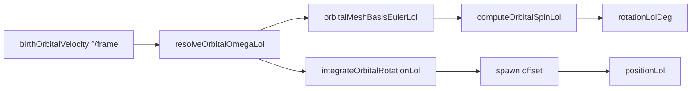

# Implementation Documentation — VFX birthOrbitalVelocity

**Save location:** `feature_md/feature/feature-vfx-orbital-velocity.md`

---

## Summary

`birthOrbitalVelocity` é um `ValueVector3` com `constantValue: vec3 = { ωx, ωy, ωz }` em **graus por frame** de simulação (30 Hz). O editor usa ordem `{X,Z,Y}` e o runtime normaliza para `{X,Y,Z}` antes de integrar. Cada componente define orientação base da malha (face perpendicular ao eixo de órbita) e rotação do **offset de spawn** + **spin** da malha.

Não é `birthVelocity` (linear), nem `birthRotationalVelocity0` (spin genérico do quad).

---

## Orbita X / Y / Z

| Componente ritual (editor) | Mapeamento interno | Face da malha (normal LoL) | Eixo de órbita (rotação) |
| --- | --- | --- | --- |
| **X** (`ωx`) | X | +Y | **Y** (largura) |
| **Y** (`ωy`) | Z | +X | **X** (altura) |
| **Z** (`ωz`) | Y | +Y (cima / anel no chão) | **Y** (vertical LoL) |

Exemplo `{ 0, 12, 0 }`: valor vai para **Z interno** e produz órbita no eixo **X LoL** (pela regra `{X,Z,Y}`).

---

## Pipeline

- Código central: [`vfxOrbitalMotion.ts`](../../src/core/vfx/vfxOrbitalMotion.ts)
- Spawn: [`vfxSpawnShape.ts`](../../src/core/vfx/vfxSpawnShape.ts) — `computeParticleSpawnOffsetLol`
- Transform: [`vfxTransformEngine.ts`](../../src/core/vfx/vfxTransformEngine.ts) — basis + spin
- Integração: um passo por frame (`DEFAULT_VFX_FPS` = 30); cada passo aplica `applyOrbitalStepLol` com ω °/frame

---

## Exemplos

| Emitter | Ritual | Efeito |
| --- | --- | --- |
| `hoop2` | Lux Q `{ 0, 2, 0 }` | Valor Y do editor mapeia para eixo interno Z e afeta órbita/malha conforme regra orbital |
| `Temp_BurstUp1` | Brand `{ 0, 0.5, 0 }` | Orbita Y + probabilityTables |
| `{ 0, 12, 0 }` | — | Face cima, 12°/frame em Y |

---

## Debug

Com **Debug transform** activo:

- Inspector: `ω orbital X/Y/Z (°/frame)` já normalizado (`{X,Z,Y}` → `{X,Y,Z}`) + `ω acum. (°)` com frames
- Viewport: `ω … °/fr` no spawn; `ω … °` acumulados com idade da partícula (ex. 12, 24, 36… a ~1s, 2s, 3s com ω=12)
- Anel wireframe perpendicular ao **eixo de órbita mapeado** (não ao índice bruto do vec3)

**Travar movimento** (`vfxLockMotionEnabled`): congela órbita e spin (`spawnMotionTime = 0`).

---

## Testes

- [`vfxOrbitalMotion.test.ts`](../../src/core/vfx/vfxOrbitalMotion.test.ts) — eixos, °/frame, acumulado
- [`vfxSpawnShape.test.ts`](../../src/core/vfx/vfxSpawnShape.test.ts) — `hoop2`
- [`vfxTransformDebugList.test.ts`](../../src/core/vfx/vfxTransformDebugList.test.ts) — labels debug
- [`vfxEmbedSample.test.ts`](../../src/core/vfx/vfxEmbedSample.test.ts) — dynamics
- [`vfxOrbitalDebug.test.ts`](../../src/core/vfx/vfxOrbitalDebug.test.ts) — anel debug
