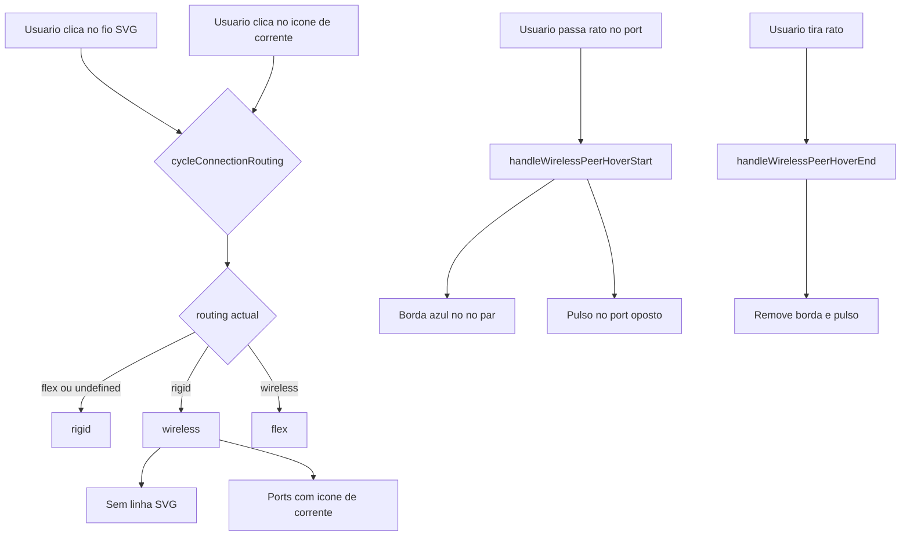
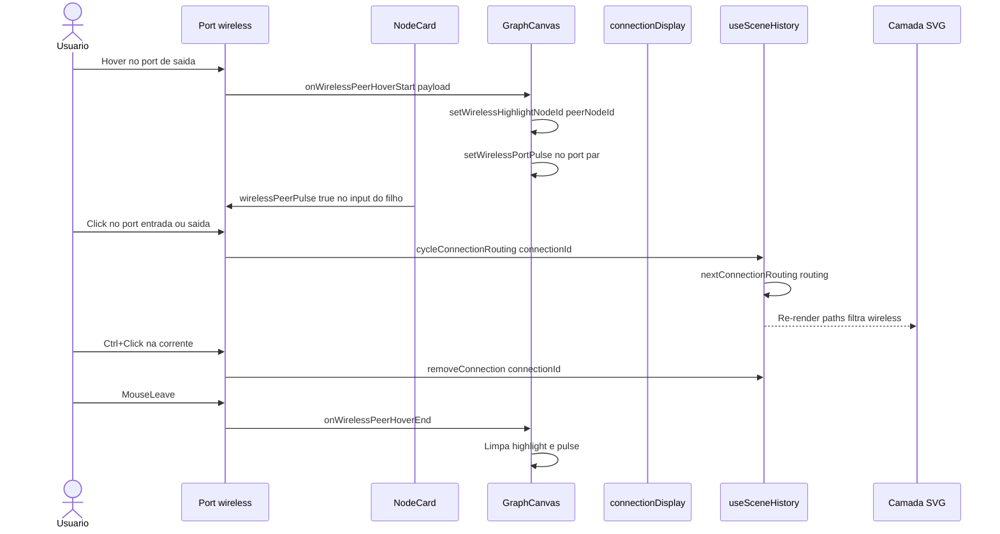

# Documentação de Implementação — Ligação sem fio (wireless)

Arquivo salvo em: `feature_md/feature/feature-wireless-connection.md`

## 1. Cabeçalho

| Campo | Valor |
| --- | --- |
| Nome da Branch | `feature/wireless-connection` |
| Nome das Features | Ligação sem fio (terceiro modo de roteamento); ícone de corrente nos ports; destaque e pulso do nó par no hover |
| Versão atual | `1.4.0` |
| Hash do Commit | `2662ffe` |

## 2. Definição e Resumo de Tags

| Tag | Definição |
| --- | --- |
| `[NOVO]` | Novo componente, arquivo, função ou tipo criado nesta branch. |
| `[ATUALIZADO]` | Componente ou fluxo existente alterado para suportar a feature. |
| `[REMOVIDO]` | Código ou comportamento removido ou descontinuado. |

Tags presentes nesta implementação:

- `[NOVO]`
- `[ATUALIZADO]`

Não houve itens classificados como `[REMOVIDO]` nesta branch.

## 3. Fluxograma de Funcionamento

## 4. Fluxograma de Acionamento de Funções

## 5. Tabela de Funções e Componentes

| Status | Nome | Feature Correspondente | Descrição Técnica | Parâmetros Recebidos / Retorno |
| --- | --- | --- | --- | --- |
| `[NOVO]` | `connectionDisplay.ts` | Ligação sem fio | Índice de ligações wireless por nó, helpers de props e detecção de pulso. | `buildWirelessDisplayByNode`, `toWirelessPortLinkProps`, `isWirelessPortPulsing`. |
| `[NOVO]` | `ConnectionRouting` valor `wireless` | Ligação sem fio | Terceiro modo persistido em `graph.json`. | `'flex' \| 'rigid' \| 'wireless'`. |
| `[NOVO]` | `nextConnectionRouting` | Ciclo de estilos | Define ordem flex → rigid → wireless → flex. | `(current?: ConnectionRouting)` → `ConnectionRouting`. |
| `[NOVO]` | `buildWirelessDisplayByNode` | Ligação sem fio | Para cada conexão wireless, mapeia input/output e metadados do par. | `(connections, nodes)` → `Map<string, WirelessNodeDisplay>`. |
| `[NOVO]` | `WirelessPortLink` / `WirelessPortPulseTarget` | Hover e pulso | Tipos para tooltip, peer e port a piscar. | Campos `peerNodeId`, `peerPulsePortKind`, `outputSlotId?`. |
| `[NOVO]` | `isWirelessPortPulsing` | Pulso no port par | Verifica se um port deve animar com base no estado global. | `(pulse, connectionId, portKind, slotId?)` → `boolean`. |
| `[ATUALIZADO]` | `cycleConnectionRouting` | Ciclo de estilos | Passa a usar `nextConnectionRouting` em vez de alternar só rigid/flex. | `(connectionId: string)` → `void`. |
| `[ATUALIZADO]` | `Port.tsx` | UI wireless | Ícone SVG de corrente, tooltip, click para ciclar, Ctrl+click remove. | Prop `wirelessLink?: WirelessPortLinkProps`. |
| `[ATUALIZADO]` | `Port.module.css` | UI wireless | Estilos `.wireless`, `.wirelessPulse`, animação `wireless-port-pulse`. | CSS modules. |
| `[ATUALIZADO]` | `GraphCanvas.tsx` | Canvas | Filtra paths wireless do SVG; estado de highlight e pulse; props para NodeCard. | `wirelessDisplayByNode`, handlers de hover. |
| `[ATUALIZADO]` | `GraphCanvas.module.css` | Destaque do no | Classe `.nodeWirelessLinked` no hover do port. | `outline-color: var(--syntax-property)`. |
| `[ATUALIZADO]` | `NodeCard.tsx` | Propagação | Repassa `wirelessDisplay`, `wirelessPortPulse`, handlers aos filhos. | Props opcionais de wireless. |
| `[ATUALIZADO]` | `NodeHeader.tsx` | Port entrada | `wirelessLink` no input; desactiva `onInputPortClick` em modo wireless. | Props `wirelessLink`. |
| `[ATUALIZADO]` | `InternalStructureItem`, `EmbedItem`, `PointerItem`, `ListEmbedItem`, `ListPointerItem`, `List2EmbedItem`, `List2PointerItem`, `MapHashStructureBlock`, `ParameterItem` e inputs map hash | Ports de saída | Lookup de `wirelessOutputLinks` e pulso por slot. | `wirelessPortHandlers`, `wirelessPortPulse`. |
| `[ATUALIZADO]` | `workspacePersistence.ts` | Persistência | Aceita `routing: "wireless"` ao carregar workspace. | `parseConnection`. |
| `[ATUALIZADO]` | `leagueBinScene.ts` | Import binário | Validação de `routing` inclui `wireless`. | Parse de conexões. |

## 6. Descrição Detalhada de Funcionamento

[NOVO] A feature introduz um **terceiro modo de ligação** entre nós do grafo, além de `flex` (curva) e `rigid` (ortogonal). O modo `wireless` remove a linha SVG, mantém a ligação lógica em `CanvasScene.connections` e representa a associação com **ícones de corrente** nos ports de saída (slot do pai) e entrada (header do filho).

[NOVO] O ciclo de estilos é **flex → rigid → wireless → flex**. O utilizador alterna clicando no **fio** (quando visível) ou no **ícone de corrente** (em modo wireless). **Ctrl+clique** na corrente remove a ligação, alinhado ao comportamento do fio.

[NOVO] O módulo `connectionDisplay.ts` constrói, por render, um mapa `wirelessDisplayByNode` com: ligação de **input** no nó filho (`toNodeId`); mapa de **outputs** por `fromInternalStructureId` no nó pai; metadados para tooltip (`peerTitle`) e para pulso (`peerPulsePortKind`, `peerPulseOutputSlotId`).

[ATUALIZADO] `GraphCanvas` exclui conexões `routing === 'wireless'` do `useMemo` de `connectionPaths`, pelo que não há hit area nem path SVG. Mantém-se `cycleConnectionRouting` no clique do fio para os modos com linha.

[ATUALIZADO] **Hover no port:** `handleWirelessPeerHoverStart` define `wirelessHighlightNodeId` (borda azul no nó par via `.nodeWirelessLinked`) e `wirelessPortPulse` (animação no port oposto — saída ↔ entrada). Ao sair do port, `handleWirelessPeerHoverEnd` limpa ambos os estados. A borda **não** fica permanente; só durante o hover.

[ATUALIZADO] O componente `Port` em modo wireless renderiza um botão com SVG inline (sem dependência externa de ícones), `title` com o texto «Este nó está conectado ao nó: {nome}», e classe `wirelessPulse` quando o port par está a ser destacado.

[ATUALIZADO] Novas ligações criadas por `connectNodes` continuam sem `routing` explícito (equivalente a `flex`). Apenas ligações existentes cicladas pelo utilizador passam a `wireless` e são persistidas em `graph.json` como `"routing": "wireless"`.

Tratamento de erros: nós ou conexões inválidas são ignoradas em `buildWirelessDisplayByNode`; slots sem entrada wireless não recebem ícone; persistência descarta `routing` desconhecido. Não altera regras de `collectionType` linking nem criação de filhos na paleta.
