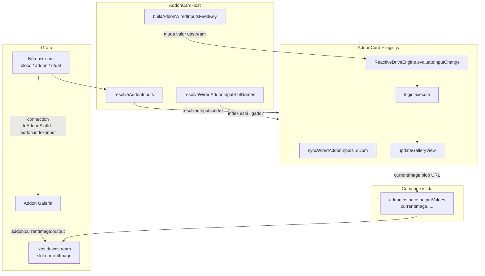
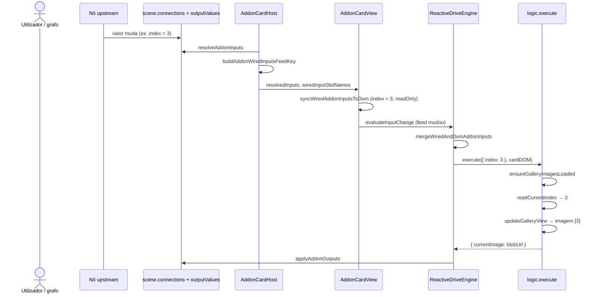

# Fluxo — Slot Index da addon-galeria

Documentação do fluxo quando um nó do grafo está ligado ao slot de entrada **Index** do add-on `addon-galeria`: como o valor do parâmetro é obtido, aplicado na UI e propagado para a saída **Imagem Atual**.

| Campo | Valor |
| --- | --- |
| Add-on | `addon-galeria` |
| Slot entrada | `index` (`addon:index:input`) |
| Slot saída | `currentImage` (`addon:currentImage:output`) |
| UI | `public/addons/addon-galeria/ui.html` — `<input id="index-input" name="index" />` |
| Lógica | `public/addons/addon-galeria/logic.js` |

---

## 1. Peças envolvidas

| Camada | Ficheiro / módulo | Função |
| --- | --- | --- |
| Manifest | `public/addons/addon-galeria/manifest.json` | Declara slot `index` (number, input) e drives `inputChange{index-input}` |
| UI | `ui.html` | Campo numérico; `name="index"` ↔ slot; `id="index-input"` ↔ drive |
| Lógica | `logic.js` | `execute()` → `readCurrentIndex` → `updateGalleryView` |
| Helpers | `contexMenu/galleryHelpers.js` | `readCurrentIndex`, `safeGalleryIndex` |
| Grafo | `instanceEvaluator.ts` | `resolveAddonInputs`, `applyAddonOutputs` |
| Ligações | `addonSlotConnections.ts` | `addonSlotId`, `resolveWiredAddonInputSlotNames` |
| Feed | `addonInputFeed.ts` | `buildAddonWiredInputsFeedKey` — dispara re-execução quando upstream muda |
| Motor reativo | `reactiveDrive.ts` | `mergeWiredAndDomAddonInputs`, `syncWiredAddonInputsToDom` |
| Card | `AddonCardHost.tsx`, `AddonCardView.tsx` | Liga cena ↔ `execute` ↔ mutação de outputs |

---

## 2. Diagrama geral



---

## 3. Ligar um nó ao slot Index

1. Arrastar um fio do **output** de outro nó para o pino **Index** da galeria.
2. A ligação fica em `scene.connections`:
   - `toNodeId` — id do nó galeria
   - `toAddonSlotId` — `"addon:index:input"`
   - `fromNodeId` / `fromAddonSlotId` (ou bloco/ritual) — origem do valor
3. `resolveWiredAddonInputSlotNames` adiciona `"index"` ao conjunto de slots ligados.

---

## 4. Origem do valor (`resolveAddonInputs`)

`AddonCardHost` recalcula sempre que `scene.connections` ou `scene.nodes` mudam:

```ts
// AddonCardHost.tsx
const resolvedInputs = resolveAddonInputs(scene, node, manifest)
```

`resolveAddonInputs` percorre ligações **entrantes** no nó da galeria e preenche `inputs[slotName]`:

```ts
// instanceEvaluator.ts (resumo)
const incoming = scene.connections.filter(
  (c) => c.toNodeId === canvasNode.id && c.toAddonSlotId,
)
for (const connection of incoming) {
  // parse addon:index:input → name "index"
  inputs[parsed.name] = resolveUpstreamValue(scene, connection, parsed.name)
}
```

### Origens típicas do valor upstream

| Origem ligada | O que é lido |
| --- | --- |
| Outro add-on (output) | `addonInstance.outputValues[nomeDoSlot]` |
| Nó bloco | `defaultValue` do parâmetro / valor do slot do bloco |
| Nó ritual | `node.values` pelo `parameterId` da ligação |

Exemplo: nó com número `5` ligado ao Index → `resolvedInputs.index` ≈ `"5"` ou `5`.

---

## 5. Comportamento no card (ligado vs livre)

### Index com fio ligado

1. `applyAddonInputFieldInteraction` — campo `input[name="index"]` fica **readOnly**.
2. `syncWiredAddonInputsToDom` — copia `resolvedInputs.index` para o DOM.
3. Edição manual no campo **não** dispara drive local.
4. Quando o upstream muda, `wiredInputsFeedKey` muda → `ReactiveDriveEngine.evaluateInputChange`.

### Index sem fio

1. Utilizador edita o `<input name="index">`.
2. Drive `inputChange{index-input}` (elemento `id="index-input"`) dispara `execute` no evento `input` / `change`.

### Fusão grafo + DOM (`mergeWiredAndDomAddonInputs`)

| Slot | Fonte em `execute(inputs, …)` |
| --- | --- |
| `index` ligado | `inputs.index` ← `resolvedInputs` (grafo) |
| `index` livre | `inputs.index` ← valor do DOM |

---

## 6. Sequência de acionamento (slot ligado)



---

## 7. Uso do índice em `logic.js`

```js
async function execute(inputs, cardDOM) {
  // Garante pasta / lista cardDOM._imageUrls, cardDOM._galleryFiles
  const loaded = await ensureGalleryImagesLoaded(cardDOM)
  if (loaded) {
    // Nova pasta: repõe índice no DOM a 0 (só efeito visual inicial)
    const indexInput = cardDOM.querySelector('[name="index"]')
    if (indexInput) indexInput.value = 0
  }
  return updateGalleryView(cardDOM, readCurrentIndex(cardDOM, inputs))
}
```

### `readCurrentIndex` (prioridade)

```js
// galleryHelpers.js
export function readCurrentIndex(cardDOM, inputs) {
  if (inputs?.index !== undefined && inputs.index !== '') {
    return parseInt(String(inputs.index), 10)
  }
  const domIndex = cardDOM.querySelector('[name="index"]')?.value
  return parseInt(domIndex || '0', 10)
}
```

Com slot **ligado**, `inputs.index` do grafo tem prioridade sobre o DOM.

### `updateGalleryView`

1. `safeIndex` — limita a `0 … _imageUrls.length - 1`.
2. Atualiza ``.
3. Sincroniza o campo Index no DOM se diferente.
4. Retorna `{ currentImage: selectedImage }` (URL blob da pré-visualização).

---

## 8. Saída para o grafo

1. `execute` devolve `currentImage`.
2. `AddonCardView` → `onGraphStateMutation(nodeId, outputs)`.
3. `applyAddonOutputsToScene` → `applyAddonOutputs` grava em `canvasNode.addonInstance.outputValues.currentImage`.
4. Nós ligados a `addon:currentImage:output` leem esse valor via `resolveUpstreamValue`.

---

## 9. Drives no manifest (comportamento)

```json
"drive": [
  "inputChange{folder-input}",
  "buttonClick{loadImages}",
  "inputChange{index-input}"
]
```

Não há `inputChange` global — só drives **por id** de elemento.

| Situação | O que dispara `execute` |
| --- | --- |
| Index **ligado** | Mudança em `wiredInputsFeedKey` (valor upstream) |
| Index **livre** | Editar campo com `id="index-input"` |
| Pasta nova | `inputChange{folder-input}` no input de pasta |
| Pasta recém-carregada | `loaded === true` pode repor DOM a `0`; índice ligado no grafo continua a mandar via `inputs.index` |

---

## 10. Resumo rápido

| Situação | Quem manda no índice | Efeito na galeria |
| --- | --- | --- |
| Index ligado a nó com valor `N` | Grafo (`resolvedInputs.index`) | Mostra imagem `#N` da pasta carregada |
| Index livre | Campo numérico no card | Drive `inputChange{index-input}` ao editar |
| Upstream muda para `7` | `wiredInputsFeedKey` | `execute` de novo → imagem 7 |
| Nova pasta aberta | `ensureGalleryImagesLoaded` | Recarrega lista; DOM pode ir a 0, mas índice ligado usa `inputs.index` |

---

## 11. Ficheiros de referência

- `public/addons/addon-galeria/manifest.json`
- `public/addons/addon-galeria/ui.html`
- `public/addons/addon-galeria/logic.js`
- `public/addons/addon-galeria/contexMenu/galleryHelpers.js`
- `src/components/molecules/AddonCardHost.tsx`
- `src/components/molecules/AddonCard/AddonCardView.tsx`
- `src/core/engine/reactiveDrive.ts`
- `src/core/addonInputFeed.ts`
- `src/core/addonSlotConnections.ts`
- `src/nodeStructures/instanceEvaluator.ts`
