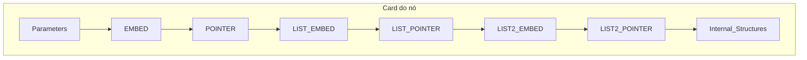

Atualmente um nó (`NodeSchemaDefinition` / instância no canvas) organiza-se em **nove famílias de elementos estruturais**, mais **metadados** que não são “elementos” no card mas afectam o comportamento.

## Secções no card do nó (ordem na UI)

| Secção | Origem no ritual / schema | O que é |
|--------|---------------------------|---------|
| **Parameters** | Campos escalares (`string`, `f32`, `rgba`, etc.) | Parâmetros editáveis com valor |
| **EMBED** | `Campo: embed = Tipo { … }` | Bloco com **no máximo 1** slot (estrutura interna ligável) |
| **POINTER** | `Campo: pointer = Tipo { … }` | Bloco com **no máximo 1** slot (como EMBED; distinto de `link`) |
| **LIST_EMBED** | `Campo: list[embed] = { … }` | Bloco de lista com **vários** slots |
| **LIST_POINTER** | `Campo: list[pointer] = { … }` | Bloco de lista com **vários** slots |
| **LIST2_EMBED** | `Campo: list2[embed] = { … }` | Lista de **instâncias** estilo EMBED (máx. 1 slot cada) |
| **LIST2_POINTER** | `Campo: list2[pointer] = { … }` | Lista de **instâncias** estilo POINTER (máx. 1 slot cada) |
| **Internal_Structures** | `link = Tipo { … }` e filhos estruturais genéricos | Portas de saída para ligar a outros nós |

Definido em `nodeSchema.ts` e renderizado em `NodeCard.tsx`.

**Nota:** `link = Tipo { }` permanece em **Internal_Structures**; `pointer = Tipo { }` vai para **POINTER**.

---

## Tipos de elemento (`NodeElementKind`)

Usados em remoção, dependências e pickers (`listNodeElements.ts`):

| `kind` | Significado |
|--------|-------------|
| `parameter` | Parâmetro escalar |
| `internalStructure` | Entrada em **Internal_Structures** |
| `embedBlock` | Bloco inteiro em **EMBED** |
| `embedSlot` | Slot dentro de um bloco EMBED |
| `pointerBlock` | Bloco inteiro em **POINTER** |
| `pointerSlot` | Slot dentro de um bloco POINTER |
| `listEmbedBlock` | Bloco inteiro em **LIST_EMBED** |
| `listEmbedSlot` | Slot dentro de um bloco LIST_EMBED |
| `listPointerBlock` | Bloco inteiro em **LIST_POINTER** |
| `listPointerSlot` | Slot dentro de um bloco LIST_POINTER |
| `list2EmbedInstance` | Instância (estilo embed) dentro de LIST2_EMBED |
| `list2PointerInstance` | Instância (estilo pointer) dentro de LIST2_POINTER |

---

## O que o menu **+ Element** pode acrescentar

Tipos de entrada no catálogo (`ElementMenuEntryKind` em `elementMenuCatalogUtils.ts`):

| `kind` | Acção típica |
|--------|----------------|
| `preset-slot` | Slot pré-definido (template) |
| `catalog-structure` | Estrutura interna do catálogo do pack |
| `catalog-parameter` | Parâmetro do catálogo (stub `*_parameter_*.json`) |
| `catalog-embed` | Item do catálogo EMBED |
| `catalog-pointer` | Item do catálogo POINTER |
| `catalog-list-embed` | Item do catálogo LIST_EMBED |
| `catalog-list-pointer` | Item do catálogo LIST_POINTER |

Acções `onPick`: `append-embed-catalog`, `append-pointer-catalog`, `append-list-embed-catalog`, `append-list-pointer-catalog`.

---

## Ficheiros stub na pasta do nó base (disco)

| Padrão de ficheiro | Conteúdo |
|--------------------|----------|
| `*_parameter_*.json` | Definição de parâmetro |
| `*_embed_*.json` | Catálogo EMBED |
| `*_pointer_*.json` | Catálogo POINTER |
| `*_listEmbed_*.json` | Catálogo LIST_EMBED |
| `*_listpointer_*.json` / `*_listPointer_*.json` | Catálogo LIST_POINTER |
| `*_list2Embed_*.json` | Catálogo LIST2_EMBED (instâncias no corpo convertido) |
| `*_list2Pointer_*.json` | Catálogo LIST2_POINTER |
| `{CollectionType}.json` | Corpo do schema (inline + metadados) |

IDs canónicos: `{collectionType}_pointer_{title}`, `{collectionType}_listPointer_{title}`, `{collectionType}_list2Embed_{title}`, `{collectionType}_list2Pointer_{title}`.

---

## Metadados no schema (não são secções do card)

- **`required_parameter`** — parâmetros obrigatórios na instância  
- **`linked_parameter_values` / `parameter_value_links`** — pares de parâmetros com valor sincronizado  
- **`hashString` / `hashStringParameterId`** — cópia de um parâmetro `string`  
- **`nomenclature`** — classificação (#0, #2, `collectionType`, `pathHierarchy`, etc.)

---

## Resumo visual

